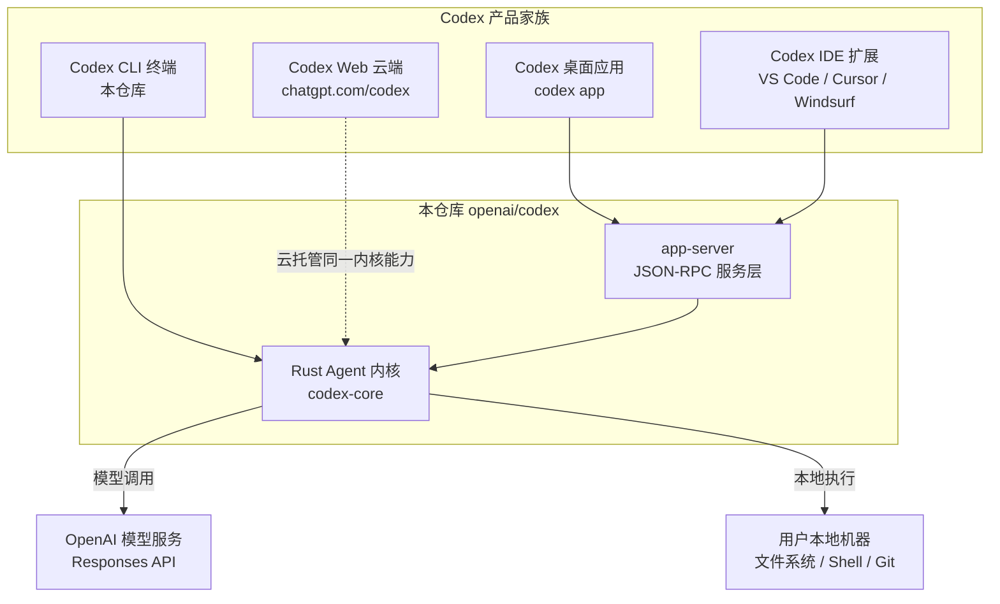
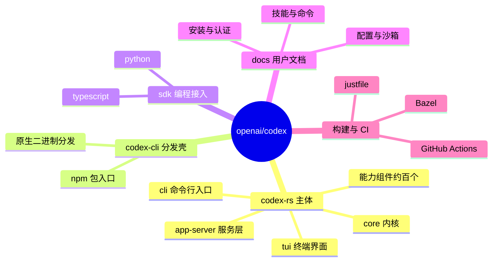
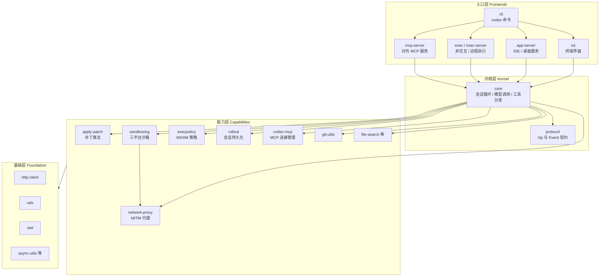
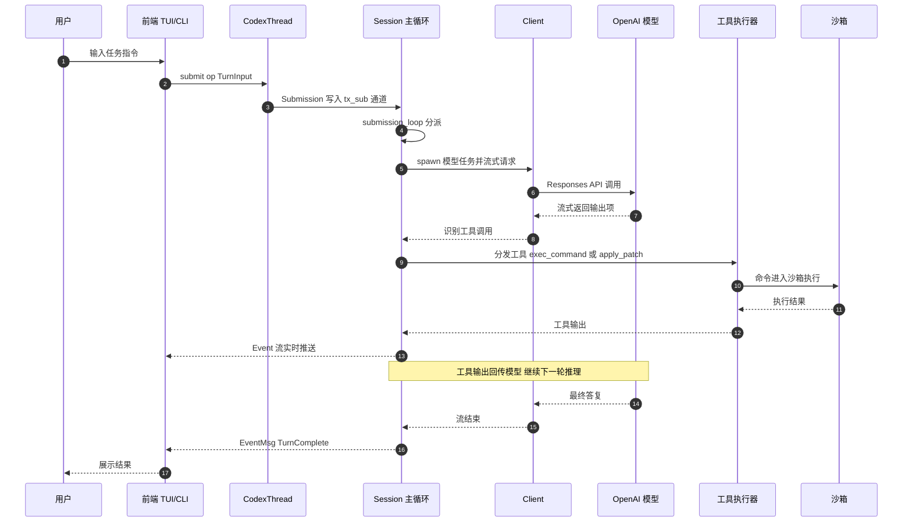
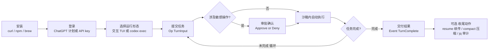

# 01 · 整体观 —— Codex CLI 全貌解读

> 三维度深度解读 · 第一篇
> 认知目标：**看见** —— 建立一张完整的项目认知地图
> 阅读建议：本篇是三部曲的地基。先读本文建立全局框架，再进入[第二篇·具体观](./02-具体观-算法与实现剖析.md)看技术细节，最后读[第三篇·深刻观](./03-深刻观-哲学与升华.md)升华本质。

---

## 一、总起：一句话定位与三个关键事实

**Codex CLI 是 OpenAI 官方开源、运行在用户本地计算机上的编码智能体（Coding Agent）**。仓库根 README 的第一句话就说得很直白："Codex CLI is a coding agent from OpenAI that runs locally on your computer."（见 [README.md](file:///workspace/README.md)）。它不是又一个"代码补全插件"，而是一个能**自主读代码、改代码、跑命令、修 bug、提交变更**的完整 Agent 系统。

理解这个项目，只需要抓住三个关键事实：

1. **它是"单内核、多前端"的**。整个仓库的核心是一个用 Rust 写成的 Agent 内核（`codex-core`），终端 TUI、CLI 非交互模式、IDE 集成、桌面 App、App Server——所有前端形态共享同一个内核，如同一个 OS 内核运行在不同的 shell 之上。
2. **它是事件驱动的**。用户向前端提交一个 `Op`（操作），内核通过异步消息循环处理，并把过程中的每一步以 `Event`（事件）流的形式推回前端。整个 Agent 的生命周期就是一条事件流。
3. **它把安全当作第一公民**。模型输出是不可信的（untrusted）——每一条 shell 命令都要经过审批策略（approval policy）与操作系统级沙箱（macOS Seatbelt / Linux Landlock+seccomp+ bubblewrap / Windows restricted token）的双重约束，网络访问还要过一道 MITM 代理。

带着这三个事实，我们自顶向下逐层展开：先看它在生态中的位置（第 1 章），再看仓库怎么组织（第 2、3 章），然后理解它为什么这样设计（第 4 章），接着走一遍完整的端到端流程（第 5 章），最后给出上手使用指南与三个典型案例（第 6 章）。

---

## 二、分述

### 第 1 章 生态定位：Codex 家族与这个仓库的角色

#### 1.1 Codex 产品家族全景

Codex 不只是"一个命令行工具"。根据 [README.md](file:///workspace/README.md) 的官方描述，Codex 家族包含四种产品形态：

| 形态 | 入口 | 定位 |
|------|------|------|
| **Codex CLI**（本仓库） | 终端运行 `codex` | 本地运行的编码 Agent，开源核心 |
| **Codex IDE 扩展** | VS Code / Cursor / Windsurf 插件 | 在编辑器内使用 Codex |
| **Codex 桌面应用** | `codex app` 或官网下载 | 桌面 App 体验 |
| **Codex Web（云端）** | chatgpt.com/codex | OpenAI 云端托管的 Agent |

**本仓库（openai/codex）是整个家族的开源心脏**：CLI 本体完全开源，而 IDE、桌面、云端形态都以这个 Rust 内核为基础构建。这也解释了为什么仓库里会同时存在 `app-server`（为桌面/IDE 提供的 JSON-RPC 服务层）、`exec-server`（远程执行服务）这些"非终端"组件——它们都是同一个内核的另一种前端暴露方式。

**图 1-1：Codex 产品生态与本仓库的位置**



*图注：这张图回答"Codex CLI 在生态中处于什么位置"——四种前端形态最终都汇聚到同一个 Rust 内核 `codex-core` 上；内核向下只做两件事：调用模型服务、操作用户本地机器。这是典型的"单内核多前端"架构。*

#### 1.2 与同类项目的差异定位

在编码 Agent 的开源生态里（如 Aider、Cline、SWE-agent 等），Codex CLI 的差异化定位非常清晰：

- **官方出品、模型协同设计**：提示词（`core/gpt-5.2-codex_prompt.md` 等）与模型（GPT-5 Codex 系列）是配套演进的，工具协议（`exec_command`、`apply_patch`）专为模型行为特征调优。
- **工业级安全边界**：这是少数把三平台 OS 级沙箱、WASM 策略引擎（execpolicy）、MITM 网络代理全部内置的 Agent 项目。
- **企业级工程化**：Bazel + Cargo 双构建体系、跨平台 CI（Linux/macOS/Windows + Wine 远程测试矩阵）、insta 快照测试、OpenTelemetry 可观测性——按生产软件的标准打造。

### 第 2 章 仓库宏观结构：monorepo 五大板块

打开仓库根目录，宏观上分为五大板块：

```text
/workspace
├── codex-rs/       # 主体：Rust workspace，约 100 个 crate
├── codex-cli/      # Node.js 分发壳（npm 包 @openai/codex 的入口）
├── sdk/            # Python 与 TypeScript SDK
├── docs/           # 用户文档（安装、配置、沙箱、技能等）
└── .github/ + bazel/ + justfile + MODULE.bazel ...   # CI 与构建体系
```

各板块职责：

- **`codex-rs/`**：绝对主体。所有核心逻辑都在这个 Rust workspace 里，workspace 成员按 `codex-` 前缀命名（如 `core` 目录对应 crate `codex-core`，这是仓库 AGENTS.md 明确的命名规范）。
- **`codex-cli/`**：npm 分发层。`bin/codex.js` 是一个薄壳，负责把 Rust 编译出的原生二进制通过 npm 包分发给全球用户——用户 `npm install -g @openai/codex` 装到的就是它。
- **`sdk/`**：`sdk/python` 与 `sdk/typescript` 提供编程语言 SDK，让开发者把 Codex 内核嵌入自己的应用。
- **`docs/`**：面向用户的文档（安装、认证、配置、沙箱机制、技能系统、斜杠命令等）。
- **构建体系**：`justfile`（日常开发命令入口）、`MODULE.bazel`（Bazel 构建定义）、`.github/workflows/`（十余条 CI 流水线）。

**图 2-1：monorepo 目录结构与职责**



*图注：一张心智图收拢 monorepo 的五大板块。注意体量的悬殊——`codex-rs` 是其余所有板块之和的数十倍，"读这个仓库"本质上就是"读 codex-rs"。*

### 第 3 章 codex-rs 解剖：约百个 crate 的四层架构

`codex-rs/Cargo.toml` 定义的 workspace 里注册了约 100 个 crate。乍看眼花缭乱，但按依赖方向切开后，会发现一个清晰的四层结构——**依赖只能自上而下，绝不允许反向**：

**（1）入口层（Frontends）—— 各种二进制程序**

| crate | 职责 |
|-------|------|
| `cli` | 统一命令行入口 `codex`。其 `main.rs` 定义了 `MultitoolCli`：无子命令时进入交互式 TUI；子命令包括 `Exec`（非交互执行）、`Login`、`Mcp`、`McpServer`、`AppServer` 等 |
| `tui` | 终端交互界面，基于 ratatui 构建，入口 `tui/src/main.rs` 调用 `codex_tui::run_main` |
| `app-server` | 为 IDE / 桌面应用提供的 JSON-RPC 服务（对外暴露 thread/app 等 API） |
| `exec` / `exec-server` | 非交互执行与远程执行服务 |
| `mcp-server` | 把 Codex 自身作为 MCP 服务器暴露给其它应用 |

**（2）内核层（Kernel）—— Agent 的大脑**

| crate | 职责 |
|-------|------|
| `core`（codex-core） | **业务核心**：会话循环、模型调用、工具分发、审批、上下文管理、提示词组装。仓库 README 明确写道："This crate implements the business logic for Codex" |
| `protocol`（codex-protocol） | **协议契约**：`Op`、`Event`、`EventMsg`、`ResponseItem`、配置类型等所有跨层消息的定义。它被 core 和所有前端共同依赖，是双方的"合同" |
| `core-api` | 内核对外 API 的薄封装 |

**（3）能力层（Capabilities）—— 一个 crate 干一件事**

内核之下是一组高度单一职责的能力组件：`apply-patch`（补丁解析与应用）、`sandboxing` + `linux-sandbox` / `windows-sandbox-rs`（沙箱）、`execpolicy`（WASM 策略引擎）、`network-proxy`（MITM 网络代理）、`file-search` / `file-watcher` / `file-system`（文件能力）、`rollout`（会话持久化）、`codex-mcp`（MCP 客户端连接管理）、`git-utils`（Git 操作）、`prompts` / `skills`（提示词与技能）、`models-manager` / `model-provider`（模型管理）、`ollama` / `lmstudio`（本地模型接入）……

**（4）基础层（Foundation）—— 通用工具箱**

`http-client`、`uds`（Unix domain socket）、`async-utils`、`otel`（OpenTelemetry）、`terminal-detection`、`build-info` 等纯工具性 crate。

**图 3-1：codex-rs 四层架构与依赖方向**



*图注：四层架构的依赖方向严格自上而下。注意两个细节：其一，所有前端（TUI/CLI/IDE/Exec/MCP）在内核面前人人平等，谁也不比谁更"亲"；其二，`protocol` 与 `core` 分离——前端只依赖协议 crate 就能理解全部消息，无需拖入庞大的内核实现。*

> 值得一提的治理细节：仓库的 AGENTS.md 中专门有一条规则——**"resist adding code to codex-core"**（抵制向 codex-core 添加代码）。当一个新功能出现时，维护者优先考虑放进既有能力 crate 或新建 crate，而不是塞进已经庞大的内核。这个"内核减肥"约定，正是四层架构能长期保持清晰的原因。

### 第 4 章 设计理念：四大支柱

通读代码后可以提炼出贯穿全仓的四大设计理念。它们是理解一切实现细节的钥匙：

**支柱一：事件驱动 Actor 内核。**
内核不暴露任何"函数调用式"API，只有两个通道：入口是 `Op` 枚举（用户/前端提交的操作），出口是 `Event` 流（内核向外广播的事件）。`protocol/src/protocol.rs` 中定义的 `Op` 包含 `Interrupt`、`TurnInput`、`RecoverTurn`、`Compact`、`Shutdown`、`ExecApproval`、`PatchApproval`、`ThreadRollback` 等约二十个变体；`EventMsg` 则包含 `TurnStarted`、`TurnComplete`、`TurnAborted`、`TokenCount`、`AgentMessage` 等。前端与内核之间是松耦合的消息通信，天然适配异步与多前端。

**支柱二：单内核多前端。**
`core/README.md` 开宗明义："This crate is designed to be used by the various Codex UIs written in Rust."（此 crate 专为 Rust 编写的各种 Codex UI 服务）。TUI、CLI、App Server、IDE 都是内核的平等客户。任何新前端只需：实现 `Op` 的提交、消费 `Event` 流，即可获得完整的 Agent 能力。

**支柱三：协议即契约。**
`protocol` crate 独立于 `core` 存在，前端依赖它即可编解码所有消息，而不必链接内核。协议类型使用 `#[non_exhaustive]`（非穷尽枚举）标记，允许向后兼容地扩展——这是把"接口稳定性"当作一等公民的设计。

**支柱四：安全纵深防御。**
模型输出被假定为不可信，因此设了四道闸（详见第二篇第 5 章）：**审批策略**（AskForApproval：`untrusted` / `on-request` / `granular` / `never`）→ **策略引擎**（execpolicy，WASM/OPA 规则）→ **OS 沙箱**（SandboxPolicy：`read-only` / `workspace-write` / `danger-full-access` 等，落到 Seatbelt / Landlock+seccomp / Windows restricted token）→ **网络代理**（MITM 拦截与按请求授权）。任何一道闸失效，下一道仍在兜底。

### 第 5 章 端到端流程：一次对话的完整生命周期

现在把镜头拉近，跟踪"用户输入一句『帮我修复这个 bug』"之后发生的全部事情。这条链路的每一环都有明确的代码锚点：

1. **前端提交**：TUI 把用户输入包装为 `Op::TurnInput`，调用 `CodexThread::submit(op)`（[core/src/codex_thread.rs](file:///workspace/codex-rs/core/src/codex_thread.rs) L190，方法注释称其为 "Conduit for the bidirectional stream of messages that compose a thread"——构成一个线程的双向消息流管道）。
2. **进入通道**：`submit` 委托给 `SessionIo::submit()`，将 `Op` 包装为 `Submission` 写入 tokio mpsc 通道 `tx_sub`（[core/src/session/mod.rs](file:///workspace/codex-rs/core/src/session/mod.rs) L781-L805）。
3. **主循环分派**：`submission_loop`（[core/src/session/handlers.rs](file:///workspace/codex-rs/core/src/session/handlers.rs) L515 起）持续 `rx_sub.recv()`，按 `Op` 变体分派——这是整个内核的"心脏"。循环开头有一句注释："To break out of this loop, send Op::Shutdown."（要跳出循环，发送 Op::Shutdown）。
4. **开启一轮对话（Turn）**：`Op::TurnInput` 进入 `turn_input::handle`（[core/src/session/turn_input.rs](file:///workspace/codex-rs/core/src/session/turn_input.rs) L141-L249），创建/复用 `TurnContext`，记录用户输入，并 `spawn` 一个模型任务。
5. **调用模型**：模型任务通过 `client.rs` 的 `stream` 方法发起推理请求（[core/src/client.rs](file:///workspace/codex-rs/core/src/client.rs) L1861-L1912）：优先走 WebSocket Responses API，失败时自动回退 HTTP SSE——`WebsocketStreamOutcome::FallbackToHttp` 分支体现了这种双通道容错。
6. **流式消费**：`map_response_events` 把 API 事件流映射为内核事件；[stream_events_utils.rs](file:///workspace/codex-rs/core/src/stream_events_utils.rs) L288-L390 识别出三类输出：**工具调用**（进入执行队列）、**普通消息**（记录为 turn item）、**致命错误**（终止本轮）。
7. **工具执行**：工具调用（如 `exec_command`）经审批检查后，在沙箱内执行；`apply_patch` 类调用则进入补丁解析与应用流程。
8. **结果回传与循环**：工具输出作为新的上下文回传给模型，触发下一轮推理——如此循环，直到模型给出最终答复，发出 `EventMsg::TurnComplete`；用户中途打断则发出 `TurnAborted`。
9. **全程留痕**：每一步都同步写入 JSONL 会话日志（rollout，文件名形如 `rollout-<timestamp>-<conversation_id>.jsonl`），支持随时恢复（resume）与回放。

**图 4-1：一次对话的端到端时序**



*图注：这是全仓最重要的一张图——注意第 10~13 步构成的"模型 ↔ 工具"循环，它是所有 Agent 的心脏；也注意所有前端与内核的交互只发生在第 2 步（提交 Op）与第 14~16 步（消费 Event），印证了"事件驱动 + 单内核多前端"两大支柱。*

### 第 6 章 使用指南与典型案例

#### 6.1 安装与登录

**安装**（三选一，详见 [README.md](file:///workspace/README.md)）：

```shell
# macOS / Linux 官方安装脚本
curl -fsSL https://chatgpt.com/codex/install.sh | sh

# npm 全局安装
npm install -g @openai/codex

# Homebrew（macOS）
brew install --cask codex
```

**登录**：首次运行 `codex` 选择 "Sign in with ChatGPT"（推荐，Plus/Pro/Business 计划均可用），或使用 API key（`codex login --api-key`）。

#### 6.2 从源码构建与开发

```shell
# 日常开发（justfile 是唯一入口，无需记 cargo 长命令）
just codex        # 编译并运行 codex CLI
just test -p codex-core   # 运行某个 crate 的测试
just fmt          # 格式化（改完代码必须跑）
just fix -p codex-tui     # 修 lint

# 深度构建走 Bazel（CI 同款）
bazel test //codex-rs/core:all
```

依赖准备：Rust 工具链（`rust-toolchain.toml` 锁定版本）、`just` 命令、可选 `cargo-insta`（快照测试工具）。

#### 6.3 常用命令速查

| 命令 / 操作 | 作用 |
|-------------|------|
| `codex` | 进入交互式 TUI（默认形态） |
| `codex "修复登录页的空指针"` | 带初始任务进入交互模式 |
| `codex exec "跑通全部测试并修复失败项"` | 非交互执行，适合脚本/CI |
| `codex resume` | 恢复上一次会话（基于 rollout JSONL） |
| TUI 内 `/compact` | 手动压缩上下文（长会话续命） |
| TUI 内 `Esc` | 中断当前轮（发送 `Op::Interrupt`） |
| TUI 内 `Ctrl+T` | 打开执行记录浮层（transcript overlay） |

**安全相关配置**（`~/.codex/config.toml`）：

```toml
# 审批策略：untrusted / on-request（默认，模型自行判断何时询问）/ granular / never
approval_policy = "on-request"

# 沙箱策略：read-only / workspace-write / danger-full-access
sandbox_policy = "workspace-write"
```

#### 6.4 典型案例

**案例 1：交互式修复一个 bug（TUI 全流程）**

小李在终端输入 `codex`，然后输入："`tests/auth.rs` 里的第 3 个测试一直失败，帮我修复。"接下来他看到：

- 屏幕实时滚动显示模型正在调用 `exec_command` 执行 `cargo test tests/auth`（事件流驱动 TUI 渲染）；
- 模型定位到 `src/auth.rs` 的空指针问题，生成 `apply_patch` 调用——TUI 弹出补丁预览，小李按下 `y` 批准（`PatchApproval`）；
- 补丁应用成功，模型再次跑测试确认全绿，输出最终说明并列出改动的文件与行号。

这个案例中，小李与内核的全部交互本质上是：提交 1 个 `Op::TurnInput` + 若干 `Op::PatchApproval`，消费一整条 `Event` 流。

**案例 2：`codex exec` 一行命令自动改代码（CI 场景）**

```yaml
# 在 CI 流水线中自动修复 lint 报警
- run: codex exec "运行 just fix，若有失败则修复它们，最后输出改动摘要" --full-auto
```

`codex exec` 走的是同一个内核、同一个 `Op::TurnInput`，只是前端从 TUI 换成了非交互管道。`--full-auto` 组合了"沙箱内自动执行 + 失败不询问"，让 Agent 在无人值守下完成机械性修复工作。

**案例 3：会话断点续传（rollout 机制）**

上午的调试会话进行到一半，小王合上电脑。下午回到工位：

```shell
codex resume   # 恢复上一次会话
```

内核从 `~/.codex/sessions/rollout-2025-05-07T17-24-21-<conversation_id>.jsonl` 反向扫描（[rollout/src/reverse_jsonl_scanner.rs](file:///workspace/codex-rs/rollout/src/reverse_jsonl_scanner.rs) 支持"从文件末尾倒着读"以快速定位状态），重建上午的全部上下文，小王直接输入"继续"即可接着干。JSONL 格式还允许直接用 `jq` 人工检视会话历史——这是"事件溯源"思想带来的天然可审计性。

**图 5-1：新手上手路径**



*图注：新手从安装到交付的完整路径。注意中间的"审批 → 沙箱执行 → 循环"三步——用户把不可信的模型输出安全地驯化为可控的工程力量，这正是 Codex 所有安全设计的目标。*

---

## 三、总结：一张认知地图收拢全文

回到开头的那三个事实，现在可以给它们一个更完整的表达：

- **它是什么**：OpenAI 官方的本地编码 Agent，开源单仓库（monorepo），主体是约百个 crate 组成的 Rust workspace。
- **它如何组织**：入口层（cli/tui/app-server/exec/mcp-server）→ 内核层（core + protocol）→ 能力层（apply-patch/sandboxing/execpolicy/network-proxy/rollout/...）→ 基础层，依赖严格单向。
- **它如何运转**：前端提交 `Op` → `submission_loop` 主循环分派 → `TurnContext` 驱动模型流式调用 → 工具在审批与沙箱约束下执行 → 结果回传循环 → `Event` 流回推前端，全程 JSONL 留痕。
- **它为何可信**：审批策略、WASM 策略引擎、三平台 OS 沙箱、MITM 网络代理四道闸构成的纵深防御。

如果只能记住一句话，请记住：**Codex CLI 的架构可以用十二个字概括——"内核很小，边界很硬，契约很清晰"**。内核（core）只负责循环与分派；边界（沙箱/审批/代理）把不可信的智能关进笼子；契约（protocol）让一切前后端解耦、可演进、可回放。

但"看见"只是第一步。内核里的 Agent 循环遵循什么学术范式？补丁算法如何做到精确匹配？上下文压缩的策略从何而来？这些"看懂"层面的问题，正是[第二篇 · 具体观](./02-具体观-算法与实现剖析.md)的任务。
