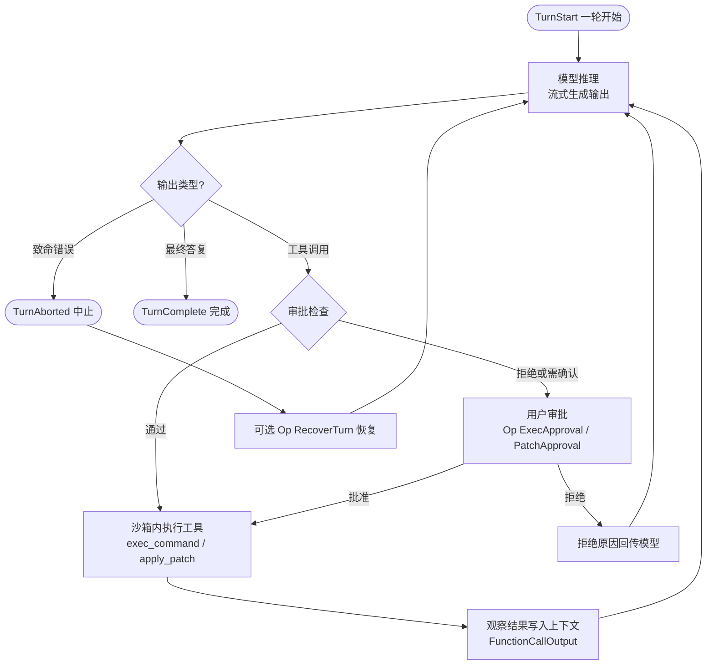
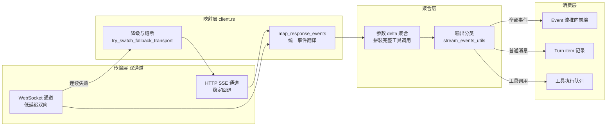
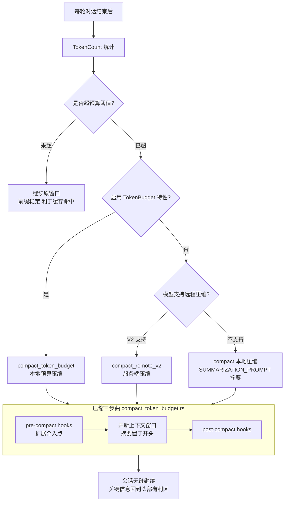
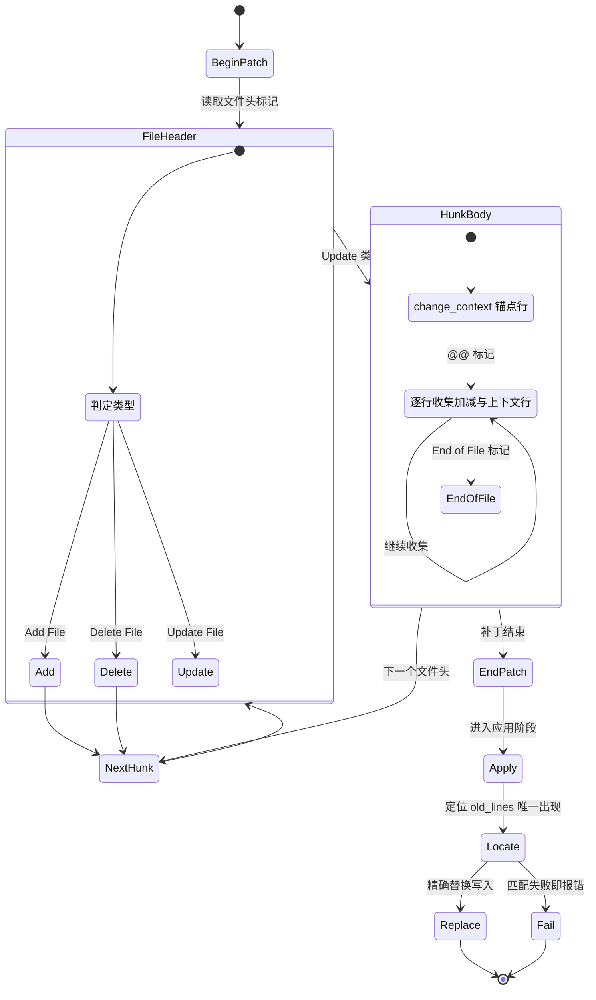
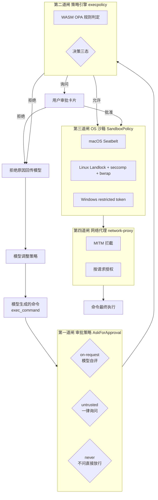
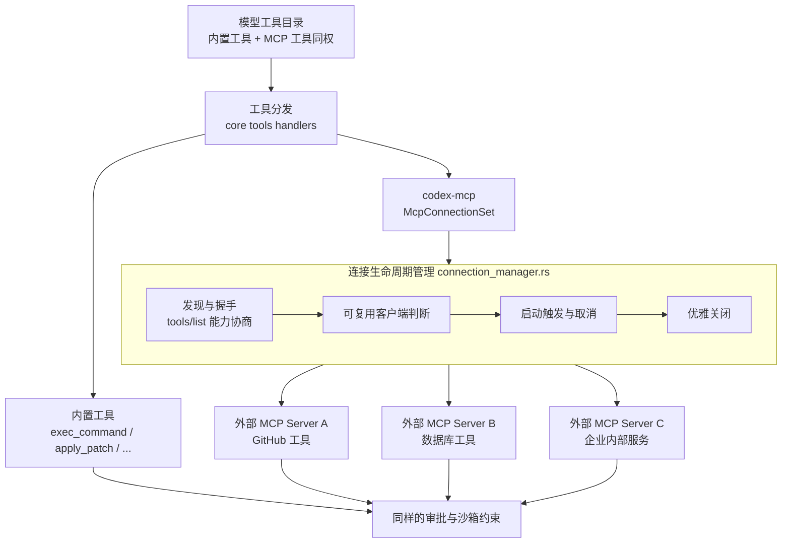
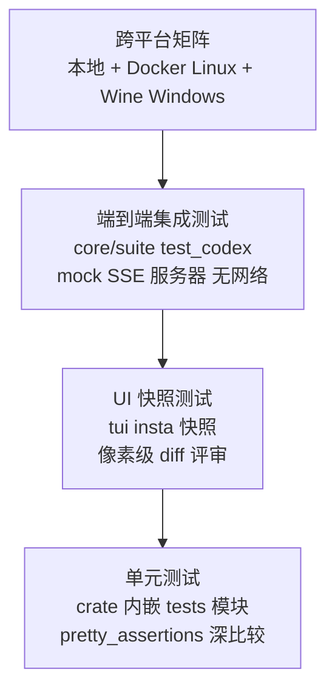

# 02 · 具体观 —— 算法与实现剖析

> 三维度深度解读 · 第二篇
> 认知目标：**看懂** —— 潜入水面之下，逐一剖析核心机制背后的学术原理与代码实现
> 前置阅读：建议先读[第一篇 · 整体观](./01-整体观-Codex全貌解读.md)建立全局框架
> 本文体例：每个技术点均按 **"论文原理 → 代码实现 → 具体例子"** 三段式展开，所有代码引用均给出真实文件锚点

---

## 一、总起：七个技术点，一个问题

第一篇回答了"Codex 是什么、怎么运转"。本篇要回答一个更尖锐的问题：**要把一个"会写代码的大语言模型"变成一个"可靠的工程伙伴"，中间隔着多少硬核技术？**

答案是七个技术点，它们环环相扣，共同支撑起"可靠的编码 Agent"这一目标：

1. **Agent 主循环**——推理与行动如何交织（ReAct 范式的工程化）
2. **流式响应与事件系统**——WebSocket/SSE 双通道的容错设计
3. **上下文工程与压缩**——长会话如何"续命"（token 预算与摘要）
4. **apply_patch 补丁算法**——搜索/替换块文法与精确应用
5. **沙箱纵深防御**——三平台 OS 级隔离与 WASM 策略引擎
6. **网络代理与 MCP 生态**——MITM 拦截与标准化工具接入
7. **极致工程实践**——双构建体系与无网络集成测试

每个技术点都不是凭空发明，其背后要么有学术论文的直接支撑，要么有工业界反复验证的最佳实践。下面逐一展开。

---

## 二、分述

### 第 1 章 Agent 主循环：ReAct 范式的工程化

#### 1.1 论文原理

**[ReAct: Synergizing Reasoning and Acting in Language Models](https://arxiv.org/abs/2210.03629)**（Yao et al., ICLR 2023）— 提出"推理轨迹（Thought）与任务行动（Action）交错生成"的通用范式：推理帮助模型跟踪计划、处理异常，行动让模型从外部环境获取真实信息，二者协同显著优于"只推理"（Chain-of-Thought）或"只行动"（Act-only），并大幅减少幻觉。

**[SWE-agent: Agent-Computer Interfaces Enable Automated Software Engineering](https://arxiv.org/abs/2405.15793)**（Yang et al., NeurIPS 2024）— 证明**接口设计（ACI，Agent-Computer Interface）与模型能力同等重要**：专为语言模型设计的精简动作空间（简化的编辑命令、聚合的操作、带护栏的反馈）能让同一个模型在真实软件工程任务上的表现成倍提升。

Codex CLI 是这两篇论文思想的集大成者：它的主循环是 ReAct 的"思考 → 行动 → 观察"循环；它的工具协议（`exec_command` 参数设计、`apply_patch` 文法、`update_plan` 计划工具）则是 SWE-agent 所倡导的、为模型量身定制的 ACI。仓库中 `core/gpt-5.2-codex_prompt.md` 的提示词工程（何时该做计划、review 的思维模式、最终答复的格式约束）同样是 ACI 思想在提示层的延伸。

#### 1.2 代码实现

主循环的代码骨架分布在四个文件中，构成一条完整的调度链：

- **`submission_loop`**（[core/src/session/handlers.rs](file:///workspace/codex-rs/core/src/session/handlers.rs) L515-L680）：内核心脏。`while let Ok(sub) = rx_sub.recv().await` 循环里用一个巨型 `match sub.op` 分派约二十种操作——`Op::Interrupt`、`Op::TurnInput`、`Op::RecoverTurn`、`Op::Compact`、`Op::ExecApproval`、`Op::PatchApproval`、`Op::Shutdown`……每个分支都返回 `false`（继续循环），只有 `Op::Shutdown` 返回 `true` 退出。这种"单线程消息循环 + 显式操作枚举"正是 Actor 模型的教科书实现。
- **`turn_input::handle`**（[core/src/session/turn_input.rs](file:///workspace/codex-rs/core/src/session/turn_input.rs) L141-L249）：一轮对话（Turn）的入口。区分 `StartOrSteer`（开启新轮或转向进行中的轮）与 `StartIfIdle`（空闲才开启），创建/复用 `TurnContext` 并 spawn 模型任务。
- **`stream_events_utils.rs`**（[core/src/stream_events_utils.rs](file:///workspace/codex-rs/core/src/stream_events_utils.rs) L288-L390）：模型输出分流器。把流式输出项分为三类：**工具调用**（进入执行队列，开启下一次"行动"）、**普通消息**（记录为 turn item，即"思考"的可见部分）、**致命错误**（终止本轮）。
- **工具处理器**（`core/src/tools/handlers/` 目录）：`exec_command`、`apply_patch`、`update_plan` 等工具的具体执行逻辑，每个工具一个模块。

#### 1.3 具体例子：一次"读 → 改 → 测"三轮循环

假设用户输入"修复登录接口的超时 bug"，事件流大致如下：

```text
TurnStarted
  ├─ 模型思考（AgentMessageDelta 流式推送）
  ├─ FunctionCall: exec_command { cmd: "rg 'timeout' src/" }     ← 第 1 轮行动：定位
  ├─ FunctionCallOutput: "src/auth/session.rs:42: timeout: 30s"
  ├─ FunctionCall: apply_patch { *** Begin Patch ... }           ← 第 2 轮行动：修改
  ├─ FunctionCallOutput: "Done!"
  ├─ FunctionCall: exec_command { cmd: "cargo test -p auth" }    ← 第 3 轮行动：验证
  ├─ FunctionCallOutput: "test result: ok. 12 passed"
  └─ AgentMessage: "已修复……修改位于 src/auth/session.rs:42"
TurnComplete
```

每一轮"行动 → 观察"的结果都会追加进对话上下文，成为下一轮"思考"的输入——这正是 ReAct 论文中 Thought/Action/Observation 交错轨迹的运行时形态。

**图 2-1：Agent 主循环状态流转**



*图注：Agent 主循环的本质是一个"思考 → 分类 → 审批 → 执行 → 观察"的状态机。注意两个回流边：观察结果回流触发下一轮思考（ReAct 循环）；审批拒绝的反馈也回流给模型（让它学会调整策略）。`Op::Interrupt` 随时可以从外部打断，`Op::RecoverTurn` 支持中断恢复——这就是生产级 Agent 与玩具 demo 的差别。*

---

### 第 2 章 流式响应与事件系统：双通道容错

#### 2.1 论文原理

**[Efficient Streaming Language Models with Attention Sinks](https://arxiv.org/abs/2309.17453)**（Xiao et al., ICLR 2024）— 揭示了自回归模型在**流式（streaming）场景**下的核心矛盾：KV 缓存随长度线性膨胀、且模型难以外推超过训练长度。论文提出的 StreamingLLM 框架（保留少量初始 token 的"注意力锚点"+ 滑动窗口）证明了流式生成是可以稳定、高效、无限延续的。

这篇论文解释了一个工程事实：**为什么现代 Agent 的交互形态必须是流式的**。用户不可能等模型 30 秒生成完毕再看到第一个字；更重要的是，Agent 需要在工具调用的参数尚未生成完毕时就开始准备执行环境。Codex 的整个事件系统（`EventMsg` 细粒度拆分、`AgentMessageDelta` 增量推送）都是围绕"流式优先"设计的。

（补充背景：OpenAI Responses API 的官方文档定义了 `response.created` / `response.output_item.added` / `response.output_text.delta` / `response.completed` 等一整套流式事件类型，是 Codex 事件映射的协议基础。）

#### 2.2 代码实现

流式调用链的实现在 [core/src/client.rs](file:///workspace/codex-rs/core/src/client.rs)：

- **`stream` 方法**（L1861-L1912）：入口按 `WireApi::Responses` 分发。优先尝试 WebSocket 通道（`stream_responses_websocket`，低延迟双向），失败时通过 `WebsocketStreamOutcome::FallbackToHttp` 分支降级到 HTTP SSE（`stream_responses_api`）。L1920-L1930 的 `try_switch_fallback_transport` 会在重试预算耗尽后**永久切换到 HTTP 通道**并重置 WebSocket 会话状态——"动态降级 + 熔断记忆"的双重容错。
- **`map_response_events`**（L1986 起）：把 API 侧的原始流式事件翻译为内核统一的 `ResponseEvent`，处理流中断与取消追踪。
- **通道容量**：L1983 定义 `RESPONSE_STREAM_CHANNEL_CAPACITY: usize = 1600`，一个足够深的缓冲通道来平滑网络抖动与消费速度差。

#### 2.3 具体例子：一次工具调用的流式聚合

模型决定调用 `exec_command` 时，参数并不是一次性到达的。流式事件序列如下：

```text
response.output_item.added     → 发现新的输出项（类型 function_call）
response.function_call_arguments.delta  → {"cmd": "car"}      ← 参数增量片段
response.function_call_arguments.delta  → "go test -p codex"  ← 参数增量片段
response.output_item.done      → 完整项就绪：{"cmd": "cargo test -p codex-core"}
response.completed             → 本轮响应结束
```

`client.rs` 的流处理代码负责把这些 delta 聚合为完整的工具调用项，再交由 `stream_events_utils.rs` 分类进入执行队列。对用户而言，TUI 上看到的是命令逐字"打出来"的效果（`chatwidget.rs` 的 `active_cell` 支持流式期间的就地变更渲染）——这正是流式架构在体验层的直接受益。

**图 2-2：流式事件管道**



*图注：流式管道的四级流水线。传输层的"WebSocket 优先、SSE 兜底、熔断记忆"是生产系统对不稳定网络的诚实应对；聚合层把碎片化的 delta 拼成完整语义单元——用户看到的丝滑逐字输出，背后是这整条流水线。*

---

### 第 3 章 上下文工程与压缩：长会话的续命术

#### 3.1 论文原理

**[Lost in the Middle: How Language Models Use Long Contexts](https://arxiv.org/abs/2307.03172)**（Liu et al., TACL 2024）— 用控制实验证明：模型对上下文中信息的利用呈 **U 形曲线**——位于开头与结尾的信息利用最好，埋在中间的信息会被显著忽略；即使标称长上下文的模型也难以幸免。这为"无限堆上下文"的朴素方案判了死刑。

这篇论文直接指向 Codex 上下文工程的两条铁律：**其一，上下文必须有预算（TokenBudget）约束；其二，接近极限时必须压缩（compact）而非硬塞**。压缩的本质是把"沉入中部、即将失效"的历史蒸馏成一份放在新窗口开头的高浓度摘要，让关键信息重新回到 U 形曲线的"头部有利区"。（补充：OpenAI 与 Anthropic 的提示词缓存机制也要求上下文前缀稳定——频繁改写历史会导致缓存全量失效，这是仓库 AGENTS.md 中"模型可见上下文禁止历史重写、避免频繁变更导致缓存未命中"两条工程铁律的来源。）

#### 3.2 代码实现

上下文管理的三个关键文件：

- **[core/src/tasks/compact.rs](file:///workspace/codex-rs/core/src/tasks/compact.rs)**（L28-L85）：压缩任务的三路分派。若启用 `Feature::TokenBudget` 特性走 `compact_token_budget`（手动 token 预算压缩）；否则按模型能力选择：`RemoteCompactionSupport::V2` 走 `compact_remote_v2` / `compact_remote`（服务端压缩），`Unsupported` 则退回本地压缩——用 `SUMMARIZATION_PROMPT` 提示词让模型自己总结自己。每条路径都调用 `emit_compact_metric` 上报遥测。
- **[core/src/compact_token_budget.rs](file:///workspace/codex-rs/core/src/compact_token_budget.rs)**（L66-L93）：token 预算压缩的执行细节——先跑 **pre-compact hook**（扩展可介入），发出 `ContextCompaction` turn item（压缩本身也被记录为对话事件！），调用 `start_new_context_window` 开新窗口，最后跑 **post-compact hook**；若 hook 阻止压缩则返回 `TurnAborted`。
- **[core/src/context_manager/history.rs](file:///workspace/codex-rs/core/src/context_manager/history.rs)**（L155-L213）：历史的存储与规范化——记录响应项、过滤 API 消息、生成发给模型的 `ResponseItem` 序列，是上下文的单一事实来源。

此外，`protocol` 中的 `EventMsg::TokenCount` 事件会持续把 token 用量推给前端——TUI 界面上的上下文用量指示由此驱动，用户可以在逼近极限前主动 `/compact`。

#### 3.3 具体例子：一次自动压缩的完整时序

一个长调试会话进行到第 40 轮，上下文达到预算阈值：

```text
1. TokenCount 事件显示 usage 已超阈值（如 80%）
2. 内核触发 compact 任务：
   a. 运行 pre-compact hooks（如扩展需要保存原始历史）
   b. 发出 ContextCompaction turn item（记录进 rollout）
   c. 用摘要提示词让模型生成会话摘要：
      "已完成：定位到超时 bug 在 src/auth/session.rs:42；
       已尝试：把 timeout 从 30s 调到 120s，测试通过一半……"
   d. start_new_context_window：新窗口 = 系统提示词 + 摘要 + 最近 N 轮
   e. 运行 post-compact hooks
3. 后续模型调用基于新窗口，token 用量回落，U 形曲线的有利区重新装载关键信息
```

压缩后用户的体验完全无缝——会话继续，只是"记忆"从流水账变成了高浓度摘要。

**图 2-3：上下文生命周期与压缩决策**



*图注：上下文压缩的决策树与三步曲。"Lost in the Middle"的学术发现在这里落成了工程约束——压缩不是可选项，而是长会话的生存必需；摘要放窗口开头，正是把关键信息从 U 形曲线的中部谷底捞回头部峰值的直接手段。*

---

### 第 4 章 apply_patch 补丁算法：为模型设计的编辑文法

#### 4.1 论文原理

**[SWE-bench: Can Language Models Resolve Real-World GitHub Issues?](https://arxiv.org/abs/2310.06770)**（Jimenez et al., ICLR 2024）— 用 2,294 个真实 GitHub issue 构建的评测基准证明：真实软件工程任务的成败关键不在"会不会写代码"，而在**能否产出可被机器验证的正确补丁**（patch）——任务以"补丁应用后测试通过"为唯一判据。这一"补丁即交付物"的思想深刻影响了后续所有编码 Agent 的设计。

（实践源头：OpenAI 在 Codex 系列中采用的 `*** Begin Patch` 搜索/替换块格式，与 Aider 社区验证过的 "search/replace block" 编辑格式一脉相承——相比标准 diff，它对模型生成的容错性更强，不需要精确的行号对齐。）

#### 4.2 代码实现

补丁算法全部集中在独立的 `apply-patch` crate（遵循"能力下沉、内核瘦身"的仓库治理原则）：

- **[apply-patch/src/parser.rs](file:///workspace/codex-rs/apply-patch/src/parser.rs)**：文件开头就用一段 **Lark 形式文法**完整定义了补丁格式：

```text
start: begin_patch environment_id? hunk+ end_patch
begin_patch: "*** Begin Patch" LF
add_hunk:    "*** Add File: " filename LF add_line+
delete_hunk: "*** Delete File: " filename LF
update_hunk: "*** Update File: " filename LF change_move? change?
change_context: ("@@" | "@@ " /(.+)/) LF
change_line: ("+" | "-" | " ") /(.+)/ LF
eof_line: "*** End of File" LF
```

  解析产物是类型化的 `Hunk` 枚举（L66-L82）：`AddFile { path, contents }` / `DeleteFile { path }` / `UpdateFile { path, move_path, chunks }`。`UpdateFileChunk`（L114-L132）是核心数据结构：`change_context`（上下文锚点行，通常是函数签名）、`old_lines`（待替换行）、`new_lines`（替换后行）、`context_line_indices`（显式上下文行与"恰好相同"行的区分标记）、`is_end_of_file`（尾行容错标记）。
  
  解析器还实现了 **Strict/Lenient 双模式**（L154-L191）：严格模式逐标记校验；宽松模式专门兜底模型的行为怪癖——注释里记录了 GPT-4.1 会把补丁包进 `<<'EOF' ... EOF` heredoc 语法的历史问题，宽松模式会剥掉这类外壳再解析。**为模型的已知缺陷做容错，是 ACI 设计哲学的直接体现。**
  
- **[apply-patch/src/file_update.rs](file:///workspace/codex-rs/apply-patch/src/file_update.rs)**（L24-L82）：应用阶段。读取目标文件，按 `ApplyPatchFileUpdateMode` 决定是否标准化换行符（避免 CRLF/LF 差异导致匹配失败），然后用 `compute_replacements` 逐 chunk 定位 `old_lines` 的唯一出现位置并替换；所有 chunk 必须按文件顺序出现（parser.rs L78-L80 的文档注释："Chunks should be in order"），匹配不到或多处匹配都会报错——**宁可失败也不做模糊猜测**，把修复权交还给模型。

#### 4.3 具体例子：一段补丁的解剖

模型输出如下补丁（真实文法的最小示例）：

```text
*** Begin Patch
*** Update File: src/auth/session.rs
@@ fn login(
-    timeout: Duration::from_secs(30),
+    timeout: Duration::from_secs(120),
*** End Patch
```

解析与应用过程：

1. 边界校验：首行 `*** Begin Patch`、末行 `*** End Patch` 匹配；
2. 文件头：`*** Update File: src/auth/session.rs` → `Hunk::UpdateFile { path }`；
3. 上下文锚点：`@@ fn login(` → `change_context`，把搜索范围收窄到 `fn login` 函数之后；
4. 变更行：`-` 行进入 `old_lines`，`+` 行进入 `new_lines`；
5. 应用：在 `src/auth/session.rs` 中定位 `change_context` 之后 `old_lines` 的唯一出现，替换为 `new_lines`；若该行在函数外还有一处相同内容，锚点保证不会误伤。

**图 2-4：apply_patch 解析状态机**



*图注：补丁从文本到落盘的状态机。两个设计要点值得咀嚼：其一，`change_context` 锚点机制让"精确匹配"与"免行号"两个矛盾的需求得以共存；其二，应用阶段"匹配失败即报错、绝不模糊应用"——失败信息会回传给模型触发自我修正，这比静默的错误编辑安全得多。*

---

### 第 5 章 沙箱纵深防御：把不可信智能关进笼子

#### 5.1 论文原理

**[Landlock: unprivileged access control](https://docs.kernel.org/userspace-api/landlock.html)**（Mickaël Salaün, Linux 内核官方文档）— Linux 内核的可堆叠安全模块（LSM）：允许**非特权进程自我约束**，以"规则集 + 单向不可逆"的方式限制自身及子进程的文件系统与网络访问。Landlock 的设计哲学——最小权限（least privilege）、策略只增不减、无需 root——正是现代应用沙箱的范式。

（背景对照：macOS 的 Seatbelt（`sandbox-exec`）与 Windows 的 restricted token / AppContainer 提供了另外两个平台的等价机制；三者共同构成"同一套策略语义、三份平台实现"的沙箱抽象。）

#### 5.2 代码实现

沙箱体系分三个层次：

- **策略层**（`protocol` crate）：`SandboxPolicy` 枚举定义语义化策略——`ReadOnly`（只读）、`WorkspaceWrite`（工作区可写，`.git` 与 `.codex` 目录强制只读）、`DangerFullAccess`（完全放开）、`ExternalSandbox`（外部托管）；`AskForApproval` 枚举定义审批策略——`untrusted`（不可信项目默认）、`on-request`（模型自行判断，默认值）、`granular`（细粒度开关）、`never`。两套策略正交组合。
- **管理层**（[sandboxing/src/manager.rs](file:///workspace/codex-rs/sandboxing/src/manager.rs)）：`get_platform_sandbox`（L62-L76）按编译目标三平台分发——macOS 返回 `MacosSeatbelt`、Linux 返回 `LinuxSeccomp`、Windows 按开关返回 `WindowsRestrictedToken`。`SandboxExecRequest`（L114-L126）封装执行边界：命令、cwd、环境变量、网络代理、沙箱类型、权限配置，一次性传递完整的安全上下文。
- **平台层**：
  - **Linux**（`linux-sandbox` crate + [core/README.md](file:///workspace/codex-rs/core/README.md)）：优先使用系统 `bwrap`（bubblewrap，用户命名空间隔离），找不到则回退仓库自带的 `codex-resources/bwrap` 二进制并发出启动警告；文件系统细粒度策略走 Landlock，syscall 过滤走 seccomp；WSL1 因无法创建用户命名空间被明确拒绝沙箱化命令。`/repo = write, /repo/a = none, /repo/a/b = write` 这类"父拒绝子允许"的嵌套策略会被路由到 bubblewrap 而非 Landlock——README 用一整段解释了这类边界情形的路由规则。
  - **macOS**（Seatbelt）：生成 profile 限制可写根目录，`.git`、`gitdir:` 解析目标与 `.codex` 保持只读。
  - **Windows**（`windows-sandbox-rs`）：restricted token / elevated backend，支持精确可读根、精确可写根及系统默认只读根（`C:\Windows` 等）。
- **策略引擎**（`execpolicy` crate）：把命令审批规则编译为 WASM（基于 OPA/Rego），在命令执行前做程序化判定——"允许 / 拒绝 / 询问用户"三态决策，规则可由企业统一下发。

#### 5.3 具体例子：一条危险命令的拦截全链路

workspace-write 模式下，模型生成了 `rm -rf ~/.ssh`：

```text
1. exec_command 到达审批关口
2. AskForApproval = on-request：模型自评——命令超出工作区写范围 → 发起 ExecApproval 请求
3. 同时 execpolicy WASM 规则命中 "写 HOME 目录外路径" → decision = prompt（转人工）
4. TUI 弹出审批卡片："rm -rf ~/.ssh  请求修改沙箱外路径  [y] 批准 / [n] 拒绝"
5. 用户拒绝 → 拒绝结果作为 FunctionCallOutput 回传模型
6. 模型看到拒绝原因，改用工作区内方案继续任务
```

即使用户误批，第 6 步之后还有 OS 沙箱兜底：Landlock/Seatbelt 的规则集只放行工作区写路径，`~/.ssh` 根本不在可写集合里，删除操作会被内核直接拒绝。**四道闸（审批 → 策略引擎 → OS 沙箱 → 网络代理）任何一道失守，下一道仍在防护**——这就是纵深防御（defense in depth）的含义。

**图 2-5：沙箱四道闸纵深防御**



*图注：一条命令要穿过四道闸才能真正执行。特别值得注意的是"拒绝原因回传模型"这条回流边——安全机制不是简单地说"不"，而是把拒绝变成模型可学习的反馈，让安全与智能形成共生而非对立。*

---

### 第 6 章 网络代理与 MCP 生态：内外两个方向的边界

#### 6.1 论文原理（规范引用）

**[Model Context Protocol Specification](https://modelcontextprotocol.io/specification/2025-11-25)**（Anthropic，2024-11-25 开源发布）— 定义 AI 应用与外部数据源/工具之间的开放标准：基于 JSON-RPC 2.0，服务端可暴露 Resources（资源）、Prompts（提示模板）、Tools（工具），客户端可提供 Sampling（采样）、Elicitation（用户问询）等能力。规范开篇即强调三条安全原则：**用户知情同意、数据隐私、工具即任意代码执行须谨慎对待**。

MCP 之于 Agent 生态，恰如 USB-C 之于硬件外设——把 N×M 的定制集成问题化为 N+M 的标准化对接问题。Codex 通过 `codex-mcp` crate 既做 MCP 客户端（接入外部工具）也做 MCP 服务端（被其它应用调用），是规范精神的完整落地。

#### 6.2 代码实现

**网络代理**（`network-proxy` crate）解决"出方向"的安全：沙箱内的进程不能直接访问网络，所有流量必须经过本地代理。`mitm.rs` 实现 MITM（中间人）拦截——代理持有自签 CA，对沙箱内进程做 TLS 终结，从而能看到明文请求再做策略判定；`connect_policy.rs` 与 `network_policy.rs` 决定放行或阻断；`socks5.rs` 提供 SOCKS5 入口；`windows_tcp_attribution.rs` 甚至解决了 Windows 平台"把 TCP 连接归因到发起命令"的难题（归因准确，策略才能精确到"哪条命令的哪个请求"）。`sandboxing/manager.rs` L78-L97 的 `with_managed_mitm_ca_readable_root` 把代理 CA 证书路径注入沙箱可读根——代理与沙箱协同工作的细节见证。

**MCP 连接管理**（[codex-mcp/src/connection_manager.rs](file:///workspace/codex-rs/codex-mcp/src/connection_manager.rs)）：`McpConnectionSet` 聚合多个 MCP server 连接的生命周期——L79-L129 处理"可复用客户端判断、启动触发、客户端获取、关闭、取消启动"等状态迁移；`session/mcp.rs`（[core/src/session/mcp.rs](file:///workspace/codex-rs/core/src/session/mcp.rs) L91-L149）则在会话层把 MCP 工具动态并入模型可用的工具目录。外部 MCP server 的工具与内置工具（exec_command 等）在模型眼里完全同权。

#### 6.3 具体例子

**例 A（网络拦截）**：沙箱内模型运行 `pip install requests`，请求 `pypi.org`：

```text
沙箱内进程 --(被 Landlock 限制只能连代理)--> network-proxy
  → mitm.rs 完成 TLS 终结，看到明文：GET https://pypi.org/simple/requests/
  → connect_policy 判定：pypi.org 不在允许列表
  → 阻断，返回策略原因给进程 → 进程报错 → 错误输出回传模型
  → 模型转而请求用户授权，或改用离线方案
```

**例 B（MCP 接入）**：用户在 `~/.codex/config.toml` 配置了一个 GitHub MCP server。会话启动时 `McpConnectionSet` 拉起该 server 进程，握手后发现它暴露 `create_issue`、`search_repos` 等工具；这些工具被并入模型工具目录。之后模型要开 issue 时直接调用 `create_issue`——与调用内置 `exec_command` 走同一套审批与沙箱约束。**接入即受管，生态开放性与安全性不矛盾。**

**图 2-6：MCP 连接管理架构**



*图注：MCP 架构的关键洞察是"同权"二字——外部 MCP 工具与内置工具走完全相同的分发、审批、沙箱管线。生态的开放性（接入任意 MCP server）与安全的完备性（全部受管）由此兼得，这是对 MCP 规范"工具即任意代码执行须谨慎"原则的忠实实现。*

---

### 第 7 章 极致工程：双构建体系与无网络测试

#### 7.1 原理来源

**[Software Engineering at Google](https://abseil.io/resources/swe-book)**（Winters, Manshreck & Wright, O'Reilly 2020，"SWE Book"）— 系统化阐述谷歌的大规模工程实践：构建系统决定协作规模（Bazel 章节）、"测试金字塔"决定迭代速度（大小测试配比）、可观测性决定运行可debug性。Codex 仓库是这个思想在开源世界的忠实学生。

#### 7.2 代码实现

- **双构建体系**：`Cargo.toml`（开发者日常，`just codex` / `just test` 一键直达）+ `MODULE.bazel`（CI 与发布，跨平台远程缓存与精确依赖闭包）。每个 crate 同时维护 `Cargo.toml` 与 `BUILD.bazel`，依赖变更时要求同步刷新 `MODULE.bazel.lock`（AGENTS.md 明文规定，CI 校验漂移）。
- **无网络集成测试**：`core/suite` 目录下的 `test_codex` 框架可以在**完全不联网**的情况下跑通端到端 Agent 测试——用一个 mock 服务器伪造 Responses API 的 SSE 事件流（`ev_response_created` / `ev_function_call` / `ev_completed` 等构造器），断言内核的请求体与最终行为。AGENTS.md 对测试写法有细致规范：优先集成测试、用 `pretty_assertions::assert_eq!` 深比较整个对象、避免为静态值写测试。
- **快照测试**：TUI 的所有渲染输出用 `insta` 快照锁定——任何 UI 变更都会在 `*.snap` 文件里显式 diff 出来，强制评审者"看见"每一处像素级变化。
- **跨平台矩阵**：本地、Docker（Linux）、Wine（模拟 Windows exec server）三套执行环境；`skip_if_target_windows!` / `skip_if_wine_exec!` 等宏精确标注每个测试的环境依赖。
- **可观测性**：`otel` crate 内建 OpenTelemetry 支持，`client.rs` 中的 `InferenceTraceContext`、`stamp_ws_stream_request_start_ms`（L1937-L1946）把每次请求的传输时间戳打点上报——生产环境的每一次推理都可追溯。
- **细节控**：`rollout/src/reverse_jsonl_scanner.rs` 实现了 JSONL 的**反向扫描**——恢复会话时从文件末尾倒着找最新状态，避免全量读取几十 MB 的历史；`arg0` crate 用一个二进制的多路分发（按 argv[0] 决定行为）节省分发体积。

#### 7.3 具体例子：一个测试如何"欺骗"内核

`core/suite` 里的典型测试（节选自 AGENTS.md 记载的标准模式）：

```rust
// 伪造一个只会返回一次 SSE 流的 mock 服务器
let mock = responses::mount_sse_once(&server, responses::sse(vec![
    responses::ev_response_created("resp-1"),
    responses::ev_function_call(call_id, "shell", r#"{"cmd":"echo hi"}"#),
    responses::ev_completed("resp-1"),
])).await;

// 向真实内核提交一个用户轮次
codex.submit(Op::UserTurn { /* ... */ }).await?;

// 断言内核确实发出了工具调用、并把结果回传给了"模型"
let request = mock.single_request();
assert_eq!(request.function_call_output(call_id), "hi\n");
```

内核并不知道对面的"OpenAI"其实是一个本地 mock——**协议契约（protocol crate）的稳定性让"内核"与"模型服务"可以彻底解耦测试**，这正是第一篇"协议即契约"支柱的工程红利。

**图 2-7：测试体系金字塔**



*图注：测试金字塔从下到上：单元测试保证算法正确，快照测试锁定用户可见的每一处变化，集成测试在无网络环境下验证完整 Agent 行为，跨平台矩阵兜住三平台差异。四层缺一不可——这正是"生产级开源项目"与"能跑的 demo"之间的距离。*

---

### 附：源码阅读路线图（使用指南）

如果你想深入本仓库源码，推荐按依赖逆序阅读（由外向内），每站约花 1~2 小时：

| 站点 | 入口文件 | 停留重点 |
|------|----------|----------|
| ① 协议契约 | `protocol/src/protocol.rs` | 通读 `Op`、`EventMsg` 两个枚举——它们是全仓的"词汇表" |
| ② 会话循环 | `core/src/session/handlers.rs` 的 `submission_loop` | 理解消息分派；对照 `turn_input.rs` 看一轮如何开启 |
| ③ 模型客户端 | `core/src/client.rs` 的 `stream` | 看 WebSocket → SSE 的降级逻辑与流式事件映射 |
| ④ 工具系统 | `core/src/tools/handlers/` | `shell_spec.rs` 的参数定义是最典型的 ACI 设计样本 |
| ⑤ 补丁算法 | `apply-patch/src/parser.rs` | 先读文件头的 Lark 文法注释，再看解析实现 |
| ⑥ 沙箱体系 | `sandboxing/src/manager.rs` + `core/README.md` | 平台分发逻辑与三平台差异说明 |
| ⑦ 持久化 | `rollout/src/recorder.rs` | JSONL 记录格式与恢复机制 |

**案例：为理解"审批如何打断工具执行"而设计的阅读路径** —— 从 `protocol.rs` 的 `Op::ExecApproval` 出发 → 在 `handlers.rs` 的 `submission_loop` 找到分派分支 → 顺藤摸瓜到审批状态管理 → 最后看 TUI 如何渲染审批卡片。一条问题驱动的阅读线，胜过十遍漫无目的的浏览。

---

## 三、总结：七个技术点如何共同支撑"可靠"

回望本篇的七个技术点，它们并非并列关系，而是构成了一个闭环：

- **Agent 主循环**（第 1 章）是骨架——ReAct 范式给出了"思考与行动交织"的理论形状；
- **流式系统**（第 2 章）是血液——让骨架有了实时反应的脉搏；
- **上下文工程**（第 3 章）是代谢——长会话不至于"肥胖而死"；
- **apply_patch**（第 4 章）是双手——SWE-bench 的启示"补丁即交付物"塑造了这对精确的手；
- **沙箱与代理**（第 5、6 章）是免疫系统——四道闸把不可信的智能约束在可预测的轨道上；
- **极致工程**（第 7 章）是骨骼密度——让前面一切在百人协作、三平台、百万用户规模下不散架。

七者合一，才配得上"可靠的编码 Agent"这个定语。每一个技术点单独拿出来都有论文与先例，Codex 的贡献在于**把它们熔铸成一个有机整体**。

但"看懂"仍然不是终点。为什么这些技术恰好以这样的方式组合？这背后是否有一个统一的思想内核？当你合上代码、只带走两三句话时，你希望记住的是什么？——这些"看透"层面的问题，留给[第三篇 · 深刻观](./03-深刻观-哲学与升华.md)。
