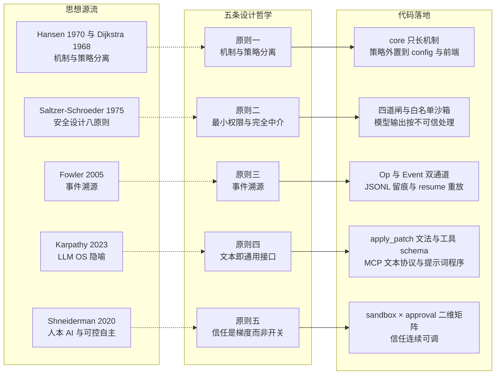
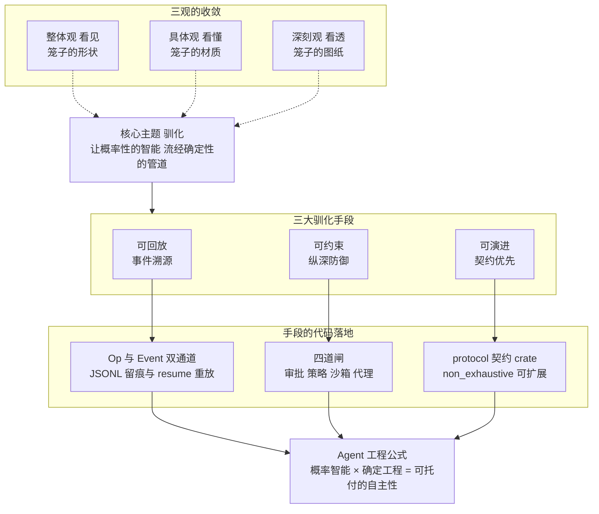
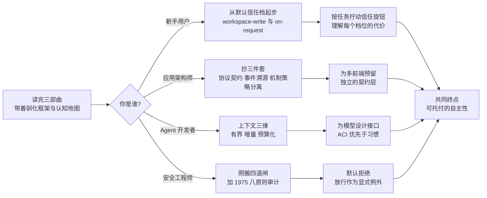

# 03 · 深刻观 —— 哲学与升华

> 三维度深度解读 · 第三篇（终篇）
> 认知目标：**看透** —— 跃出代码之外，追问设计背后的哲学根源与思想谱系，最终把整个项目收拢为两三句话
> 前置阅读：建议先读[第一篇 · 整体观](./01-整体观-Codex全貌解读.md)与[第二篇 · 具体观](./02-具体观-算法与实现剖析.md)
> 本文体例：按 **"设计哲学 → 框架思想 → 核心主题"** 三层递进展开，一层比一层深，最后一层收敛为一个词

---

## 一、总起：当所有细节都看清之后，剩下的问题

三部曲走到这里，前两篇已经完成了两次认知升级：

- **第一篇 · 整体观**让我们**看见**：Codex CLI 是"单内核、多前端"的本地编码 Agent，十二个字概括它的架构——**内核很小，边界很硬，契约很清晰**。
- **第二篇 · 具体观**让我们**看懂**：支撑"可靠"这个定语的，是七个技术点的熔铸——ReAct 主循环、流式双通道、上下文压缩、apply_patch 文法、四道闸沙箱、网络代理与 MCP、极致工程。

但认知还差最后一跃。闭上眼睛，把所有代码细节都忘掉，一些更根本的问题浮现出来：

1. 为什么恰好是**这些**技术、以**这种**方式组合？沙箱为什么是四道闸而不是一道？前后端之间为什么是事件流而不是函数调用？一切接口为什么固执地保持文本形态？
2. 这些设计是天才的灵光一现，还是有迹可循的思想源流？

把这两个问题追问到底，会得到一个令人意外的发现——**这个看起来最"AI 原生"的项目，最深的根几乎全部扎在 1948–1975 年的经典系统科学里**：控制论、Actor 模型、操作系统安全原则、认知心理学的记忆理论。AI 时代的新问题，最终被证明是经典系统科学的老问题在更大尺度上的重演。

本篇的任务，就是完成这次追问。路径分三层，层层下潜：先提炼**五条设计哲学**（第 1 章，设计层面"怎么做"），再上溯**三大理论谱系**（第 2 章，思想层面"从哪来"），最后收敛为**一个核心主题**（第 3 章，本质层面"是什么"），并给出把"看透"变成"可用"的行动指南（第 4 章）。

---

## 二、分述

### 第 1 章 设计哲学：五条根原则

通读全仓之后回望，Codex 的每一个重要设计决策，都能追溯到一条清晰的根原则。这五条原则彼此咬合，构成了整个项目的哲学底座。

#### 1.1 机制与策略分离（Mechanism vs. Policy）

**思想源流**：操作系统设计的第一戒律。Per Brinch Hansen 在 *The Nucleus of a Multiprogramming System*（CACM, 1970）中最先把"系统提供什么能力"（机制）与"谁在何时被允许使用"（策略）拆开；Dijkstra 的 THE 系统（CACM, 1968）则示范了严格的分层分离。此后半个世纪，从微内核到浏览器再到数据库，凡长寿的系统几乎都遵守这条戒律。

**在 Codex 中的体现**：内核 `codex-core` 只提供**机制**——消息循环、模型调用、工具分发、补丁应用、事件广播；而所有**策略**都被外置：

| 机制（core 提供） | 策略（外置在哪） |
|------------------|-----------------|
| 能执行任意 shell 命令 | 执行哪条命令要审批？→ `approval_policy`（[protocol.rs](file:///workspace/codex-rs/protocol/src/protocol.rs) L916 `AskForApproval`：`untrusted` / `on-request` / `granular` / `never`） |
| 能在 OS 沙箱内跑进程 | 沙箱开多大？→ `sandbox_policy`（`read-only` / `workspace-write` / `danger-full-access`） |
| 能输出事件流 | 事件如何呈现？→ 前端：TUI 渲染成界面、exec 打印到管道、app-server 序列化为 JSON-RPC |
| 能持久化会话 | 何时压缩、何时恢复？→ 用户手动 `/compact`、`codex resume` |

**一个直观的例子**：同样是"模型想执行 `cargo test`"这个机制事件，TUI 前端会弹出一个带 `y/n` 键的审批框（心理可接受性策略），`codex exec --full-auto` 会在沙箱内静默放行（无人值守策略），IDE 前端则弹出图形化确认卡（另一种呈现策略）——**机制一次实现，策略千变万化**。

仓库的 AGENTS.md 里那条著名的治理规则——"resist adding code to codex-core"（抵制向内核添加代码）——正是这条原则的组织化表达：内核只准长机制，不准长策略。

#### 1.2 最小权限与完全中介（Least Privilege & Complete Mediation）

**思想源流**：[The Protection of Information in Computer Systems](http://web.mit.edu/Saltzer/www/publications/protection/)（Saltzer & Schroeder, *Proceedings of the IEEE*, 1975）提出的安全系统设计八原则，是整个信息安全学科的奠基文献。其中几条几乎是 Codex 安全架构的逐字实现：

| Saltzer-Schroeder 原则 | Codex 中的实现 |
|------------------------|---------------|
| **完全中介**（Complete Mediation）：每次访问都必须检查 | 四道闸——每一条 shell 命令都要依次经过审批策略、WASM 策略引擎、OS 沙箱、网络代理，无一豁免 |
| **最小权限**（Least Privilege）：只给完成任务所必需的最小权限 | `workspace-write` 沙箱只开放工作区写权限，其余路径只读 |
| **安全默认值**（Fail-safe Defaults）：默认拒绝，许可作为例外 | 沙箱策略以"能写哪里"白名单表达；审批默认逐条询问 |
| **机制经济性**（Economy of Mechanism）：保持机制小而简单 | "内核减肥"治理规则；四层架构依赖单向；单 crate 单职责 |
| **心理可接受性**（Psychological Acceptability）：安全界面必须好用 | TUI 一键 `y/n` 审批、补丁 diff 预览、`--full-auto` 一键放档 |
| **开放设计**（Open Design）：安全性不依赖保密 | 整个仓库开源，安全边界靠机制而非隐匿 |

**为什么说这是"范式转移"**：传统软件安全的隐含前提是"代码是人写的，经过 review 与测试后基本可信"——安全主要防外来攻击者。而 Agent 时代的前提彻底变了：**模型的每一条输出都不可信（untrusted），而且它不是外部攻击者，是系统自身的执行引擎**。这个转变让 Saltzer-Schroeder 的原则从"最佳实践"升格为"生存必需"——完全中介不再是锦上添花，而是系统能否存在的先决条件。Codex 把模型输出当作不可信输入处理，等于把 1975 年的论文在 2025 年的语境下重新写了一遍。

#### 1.3 事件溯源（Event Sourcing）

**思想源流**：Martin Fowler 的经典词条 [Event Sourcing](https://martinfowler.com/eaaDev/EventSourcing.html)（2005）——不存储"当前状态"，而存储"导致状态的所有事件"，状态由事件重放（replay）导出。

**在 Codex 中的体现**：这是全仓最彻底贯彻的一条原则，贯穿三个层面：

1. **内存层**：前后端之间只有 `Op`（进入事件）与 `Event`（导出事件）双通道，内核的"状态"本身就是消息循环处理的累计结果——`submission_loop`（[core/src/session/handlers.rs](file:///workspace/codex-rs/core/src/session/handlers.rs)）逐条消费消息、逐条演化状态，这正是事件溯源的定义。
2. **磁盘层**：每个会话被写成 append-only 的 JSONL 日志（rollout，形如 `rollout-<timestamp>-<conversation_id>.jsonl`），只增不改。
3. **恢复层**：`codex resume` 从 JSONL 末尾反向扫描（[rollout/src/reverse_jsonl_scanner.rs](file:///workspace/codex-rs/rollout/src/reverse_jsonl_scanner.rs)）重建全部上下文——恢复即重放；`Op::ThreadRollback` 支持把会话回退到某个历史事件点——回退即"重放到第 N 条"。

**带来的三大免费红利**：可回放（出问题能复现现场）、可审计（`jq` 直接审阅会话历史）、可恢复（崩溃与会话中断不再是灾难）。"时间"在这个系统里成为一等公民——这与数据库领域的 WAL、分布式系统领域的复制日志一脉相承。

#### 1.4 文本即通用接口（Text as Universal Interface）

**现实约束出发的原则**：模型唯一可靠的输入输出介质是文本。于是 Codex 把一切边界都"文本化"了：

- 工具协议是文本：`exec_command` 的参数是 JSON 文本，模型"写"出调用，内核解析执行；
- 补丁是文本：`apply_patch` 是一套专为模型设计的搜索/替换文法（第二篇第 4 章），而非二进制 diff；
- 生态接口是文本：MCP 消息是 JSON-RPC 文本；
- 连"程序"都是文本：提示词（如 `core/gpt-5.2-codex_prompt.md`）本质上是一份用自然语言书写的、模型可执行的"行为规范程序"。

**思想源流**：这正是 Andrej Karpathy 在 2023 年提出的 [LLM OS](https://twitter.com/karpathy/status/1723140519554105733) 隐喻——**大模型不是聊天机器人，而是新一代操作系统的内核进程**。把这张隐喻表套在 Codex 上，严丝合缝：

| OS 概念 | LLM OS 隐喻 | Codex 中的对应物 |
|---------|------------|-----------------|
| CPU / 内核 | 模型 + 主循环 | GPT-5 Codex 模型 + `submission_loop` |
| 系统调用 | 工具调用 | `exec_command` / `apply_patch` / `update_plan` |
| RAM | 上下文窗口 | token 预算管理与 compact 压缩 |
| 进程 | Agent 会话 | Thread / Turn |
| 进程隔离 | 沙箱 | 三平台 OS 沙箱 + 四道闸 |
| 系统调用 ABI | 标准化工具接口 | MCP 协议 |
| 外设驱动 | 外部能力接入 | MCP server（数据库、浏览器、内部工具……） |

"文本是模型的机器码"——这句话解释了为什么 Codex 宁可为补丁专门设计一套文法，也不复用 git diff：**接口必须迁就模型的生成方式，而不是迁就程序的解析习惯**（SWE-agent 的 ACI 论证，见第二篇第 1 章）。

#### 1.5 信任是梯度而非开关（Trust as a Gradient）

**在 Codex 中的体现**：安全不是二元开关，而是由两个正交维度张成的**连续可调矩阵**：

```text
                          审批策略 approval_policy
                    untrusted   on-request   granular   never
沙箱 read-only         ●最保守      ●          ●         ●
策略
workspace-write        ●           ●默认档     ●          ●
danger-full-access     ●           ●          ●         ●最激进
```

从左上角的 `(read-only, untrusted)`（每步必问、只准看）到右下角的 `(danger-full-access, never)`（全放行），用户可以按任务的风险等级**连续拧动信任旋钮**。`codex exec --full-auto` 这样的预设，本质是矩阵上一个被命名了的点。

**思想源流**：Ben Shneiderman 多年倡导的人本人工智能（Human-Centered AI）——真正的自主性（autonomy）必须是**可控的自主性**：自动化程度越高，人类对过程的理解与干预通道就必须越顺畅，否则用户要么不敢用，要么被反噬。Codex 的审批矩阵 + 实时事件流 + 随时 `Esc` 中断，正是"可控自主"的完整实现。

**图 3-1：五条根原则到代码组件的映射**



*图注：左列是半个世纪以来的思想源流，中列是提炼出的五条设计哲学，右列是它们在代码中的具体落点。这张图本身就是一个例证——没有任何一条原则是"AI 时代的新发明"，Codex 做的是把经典系统科学的原则严格执行到一个新领域。*

---

### 第 2 章 框架思想：三大理论谱系

第 1 章回答了"怎么设计"，这一章再往下挖一层："这些设计的思想从哪来？" 三个理论谱系——并发、控制、认知——恰好对应 Agent 系统的三大本质难题：**多前端如何共存？任务如何收敛？心智住在哪里？**

#### 2.1 并发之根：Actor 模型

**理论**：[A Universal Modular ACTOR Formalism for Artificial Intelligence](https://dl.acm.org/doi/abs/10.5555/1624775.1624804)（Hewitt, Bishop & Steiger, IJCAI 1973）提出 Actor 模型：一切计算实体都是 Actor，拥有私有状态与邮箱，彼此只通过异步消息通信，绝不共享内存。Agha 在 *Actors: A Model of Concurrent Computation in Distributed Systems*（MIT Press, 1985）中给出了形式化语义。五十年来，这套模型支撑了 Erlang（电信级容错）、Akka（高并发服务）直到当代的大规模分布式系统。

**Codex 是教科书级的 Actor 实现**：

| Actor 模型要素 | Codex 中的对应 |
|----------------|----------------|
| Actor（封装私有状态的计算实体） | `CodexThread` / `Session`（[core/src/codex_thread.rs](file:///workspace/codex-rs/core/src/codex_thread.rs)，其文档注释自称"双向消息流的管道 conduit"） |
| 邮箱（Mailbox，逐条消费消息） | tokio mpsc 通道 `tx_sub` / `rx_sub` |
| 逐条处理、无锁 | `submission_loop` 单线程 `while let Ok(sub) = rx_sub.recv().await` |
| 一切交互皆消息 | 连"打断"也是一条消息——`Op::Interrupt`，而不是一个信号或一个共享标志位 |

**为什么 Agent 内核必须是 Actor？** 因为 Agent 天生是并发系统：用户随时打断、多个前端随时提交、工具在后台执行、事件在持续流出。共享内存 + 锁的方案在这个场景下会迅速劣化成竞态地狱；而 Actor 用"私有状态 + 消息顺序消费"把并发问题转化为纯粹的架构问题。Erlang 社区那句格言——"不要通过共享内存来通信，要通过通信来共享状态"——在 `submission_loop` 里得到了一字不差的 Rust 表达。

#### 2.2 控制之根：从控制论到 ReAct

**理论**：这条谱系最长。Wiener 在 *Cybernetics*（1948）中提出，复杂系统的核心机制是**负反馈闭环**——目标与观测的偏差驱动修正，使系统在扰动中收敛。Miller、Galanter 与 Pribram 在 *Plans and the Structure of Behavior*（1960）中把这一机制提炼为认知科学的最小单元 **TOTE**（**T**est-**O**perate-**T**est-**E**xit：对照目标测试 → 执行操作 → 再测试 → 达标则退出，否则继续）。六十年后，ReAct（Yao et al., ICLR 2023，见第二篇第 1 章）在语言模型上重新发现了同一个结构：**Thought（测试）→ Action（操作）→ Observation（再测试）**，直至任务完成。

**Agent 主循环 = TOTE 单元 = 负反馈闭环**：

```text
目标（用户任务）
   │
   ▼
思考 Thought ──── 模型推理：当前状态离目标还差什么？
   │
   ▼
行动 Action ───── 调用工具改变世界（exec_command / apply_patch）
   │
   ▼
观察 Observation ─ 工具输出回传上下文（新的"测试"结果）
   │
   └──── 未达标 → 回到思考；达标 → 退出（TurnComplete）
```

**一个具体例子**：用户说"修复登录超时 bug"。模型思考后执行 `rg 'timeout' src/`（Operate），观察到 `session.rs:42: timeout: 30s`（Test），修改代码（Operate），跑 `cargo test`（Test），看到测试失败（偏差仍在），再修改（Operate），再测试……直到全绿（Exit）。这个"改—测—再改"的循环，就是 TOTE 的工程形态。

**更深一层的洞见**：为什么"观察必须回传"是铁律？因为**没有反馈的循环是开环，开环的系统必然漂移**——在 Agent 身上，漂移的名字叫幻觉。ReAct 论文的核心实验结论（推理与行动交织优于纯推理）之所以成立，本质是控制论八十年来反复验证的同一件事：**闭环让智能对现实负责**。工具输出（真实世界的观测）持续锚定着模型，防止它的推理漂离事实。

#### 2.3 认知之根：工作记忆与延展心智

**理论**：认知科学的一条主线。Miller 的 [The Magical Number Seven, Plus or Minus Two](https://psychclassics.yorku.ca/Miller/)（*Psychological Review*, 1956）揭示了人类工作记忆的容量极限；Baddeley 与 Hitch（1974）把工作记忆建模为主动加工的临时缓冲。Clark 与 Chalmers 的 [The Extended Mind](https://consc.net/papers/extended.html)（*Analysis*, 1998）则给出哲学层面的惊人之论——**认知可以住在大脑之外**：失忆的 Otto 依赖笔记本导航，笔记本之于 Otto，正如生物记忆之于常人 Inga；当外部工具与内部过程紧密耦合地参与认知，它们就是心智的一部分。

**把这条谱系套到 Codex 上，一一对应**：

| 认知科学概念 | Codex 中的对应 |
|--------------|----------------|
| 工作记忆（容量有限，超载则失效） | 上下文窗口（token 预算，超限触发压缩） |
| 短时记忆的组块化（chunking） | 上下文的条目化（ResponseItem、ContextualUserFragment 有界注入） |
| 记忆巩固与遗忘（睡眠中压缩长期记忆） | compact 摘要压缩（长会话"续命"） |
| 序列位置效应（首尾记得清，中间忘得快） | "Lost in the Middle" 现象（第二篇第 3 章）——认知效应在模型上的复现 |
| Otto 的笔记本（延展心智） | 工具与外部世界（exec_command、文件系统、MCP 生态） |

**最深刻的一条推论**：按延展心智的论断，**Agent 的心智不在模型参数里，而在"模型 × 工具 × 上下文"构成的耦合系统里**。模型是推理引擎，但它"知道"什么，取决于上下文里装了什么；它能"做成"什么，取决于工具允许什么。参数是冻结的，认知却是活的——它流过上下文，流过工具，流回模型。

这条推论解释了整个行业的重心转移：为什么提示工程（prompt engineering）让位于上下文工程（context engineering）？因为**优化一个冻结参数系统的唯一途径，就是精心设计流经它的一切**。Codex 把上下文当作最宝贵的资源来经营——有界注入、增量追加、预算化压缩（第二篇第 3 章）——本质上是在为一个"工作记忆有限的心智"做认知外部支持设计。

**图 3-2：思想演进脉络——从控制论到编码智能体**

```mermaid
flowchart LR
    subgraph era1["奠基时代 1948-1975"]
        direction TB
        E1["1948 控制论<br/>Wiener 负反馈闭环"]
        E2["1960 认知心理学<br/>TOTE 模型 Test-Operate-Test-Exit"]
        E3["1968 分层架构<br/>Dijkstra THE 系统"]
        E4["1973 Actor 模型<br/>Hewitt 一切皆消息"]
        E5["1975 安全原则<br/>Saltzer-Schroeder 八原则"]
    end

    subgraph era2["认知时代 1974-1998"]
        direction TB
        E6["1974 工作记忆<br/>Baddeley 与 Hitch"]
        E7["1985 Actor 形式化<br/>Agha 消息传递语义"]
        E8["1998 延展心智<br/>Clark 与 Chalmers 认知超越颅骨"]
    end

    subgraph era3["智能体时代 2017-2025"]
        direction TB
        E9["2017 Transformer<br/>Attention is All You Need"]
        E10["2022 ReAct<br/>思考与行动交织的 Agent 范式"]
        E11["2023 LLM OS<br/>模型即内核 工具即系统调用"]
        E12["2024 MCP<br/>工具生态的统一接口"]
        E13["2025 Codex CLI<br/>经典思想的集大成实现"]
    end

    era1 --> era2
    era2 --> era3
```



*图注：三个时代、七十余年的思想接力。奠基时代（控制论、TOTE、分层、Actor、安全原则）给出的不是过时的历史，而是 Agent 时代的数学底座；认知时代补上了"心智如何与外部耦合"的理论；智能体时代所做的，是用大模型把这些零件重新组装成机器。Codex 站在接力棒的末端。*

---

### 第 3 章 核心主题升华：驯化不可预测的智能

现在到了三部曲的终点站。五条设计哲学、三大理论谱系，最终收敛成**一个词**——

#### 3.1 一个词收拢三部曲：驯化（Domestication）

**什么是驯化**：不是削弱智能，也不是放任智能，而是**让不可预测的智能输出，流经确定性的管道**。

- 智能负责"想"——模型在概率空间里涌现出解决方案，这本质上不可预测，也不该被预测（可预测的智能不叫智能）；
- 工程负责"管"——每一条输出都流经审批、沙箱、契约、日志构成的确定性管道，这本质上必须可预测。

用"驯化"这个词回望三部曲，三篇文档恰好构成驯化的三个视角：

| 篇章 | 视角 | 驯化框架下的角色 |
|------|------|------------------|
| 第一篇 · 整体观 | 架构 | **笼子的形状**——内核很小（循环很小）、边界很硬（笼条很密）、契约很清晰（笼门规整） |
| 第二篇 · 具体观 | 算法 | **笼子的材质**——七个技术点：主循环是笼子的骨架，四道闸是笼条，上下文工程是投喂量控制 |
| 第三篇 · 深刻观 | 哲学 | **笼子的图纸**——五条原则是设计规范，三大谱系是力学原理 |

而驯化的手段，收拢为三个"可"：

1. **可回放**（事件溯源）——发生过的都能复现，错误无处遁形；
2. **可约束**（纵深防御）——权限有边界，行为有笼条；
3. **可演进**（契约优先）——系统可生长而不崩坏，`#[non_exhaustive]` 的 `Op` 枚举（[protocol.rs](file:///workspace/codex-rs/protocol/src/protocol.rs) L542-L543）让协议能向后兼容地扩展。

#### 3.2 涌现与兜底的分工

驯化主题下，Agent 系统的分工图景变得清晰：

```text
        概率性（涌现）                     确定性（兜底）
  ┌──────────────────────┐      ┌──────────────────────┐
  │  模型：生成方案        │      │  工程：约束与责任      │
  │  · 推理路径不可预测     │  →→  │  · 每条输出过四道闸    │
  │  · 创造力来自随机性     │      │  · 全程事件留痕        │
  │  · 会犯错是常态        │      │  · 契约保证可演进      │
  └──────────────────────┘      └──────────────────────┘
```

由此可以写出这个领域的一个"行业公式"：

> **Agent 工程 = 概率性的智能 × 确定性的工程 = 可托付的自主性**

乘法而非加法——任何一侧为零，乘积即为零：只有智能没有工程，是危险的玩具（demo）；只有工程没有智能，是平庸的工具（脚本）。两者的乘积，才是用户敢把真实代码库托付给它的理由。

这个分工在人类文明里反复出现过：市场负责涌现（试错与创造），法治负责兜底（规则与救济）；科学负责涌现（假说与发现），同行评审与可重复性负责兜底；飞行员与自动驾驶的关系同理。**伟大的系统从不消灭一方的不可预测性，而是为它配上另一方的可预测性。**

#### 3.3 为什么答案藏在 1975 年

最后一个问题：为什么这个最前沿的项目，最深的设计依据来自五十年前？

因为**AI 没有发明新的系统问题，它把老问题放大到了极致**：

- "不可信代码的执行"——从"别运行来路不明的程序"放大为"系统自身引擎的每条输出都不可信"；
- "并发状态的一致性"——从多线程放大为"多前端 × 后台工具 × 流式事件"的并发；
- "资源配额"——从内存分配放大为 token 预算与上下文管理；
- "接口演化"——从 ABI 兼容放大为"模型能力与工具协议的协同演进"。

放大之后，1975 年的原则不仅没有过时，反而因为问题的极端化而更接近其本意——Saltzer 与 Schroeder 写下"完全中介"时，设想的正是"每次访问都必须检查"的严格世界；只是在人写代码的时代，工程上总能找到妥协的借口。模型不给人妥协的借口，于是原则终于被完整实现。

一句话：**我们不是缺新的 AI 理论，我们是忘了操作系统课。** Codex 的深刻之处，不在于发明了什么，而在于它诚实地承认了这一点，然后把经典做扎实。

**图 3-3：核心洞见总结——"驯化"如何统摄全仓**



*图注：一个主题（驯化）、三个手段（可回放/可约束/可演进）、三个代码落点、三观收敛，最终全部汇入一个公式。这张图是整个三部曲的浓缩——如果只允许带走一张图，带这张。*

---

### 第 4 章 使用指南：把"看透"变成"可用"

哲学如果不能落地，就只是修辞。这一章把前文的所有洞见，转换成四类读者的行动清单和三个可直接套用的案例。

#### 4.1 四类读者的行动清单

| 你是谁 | 最该带走的一句话 | 行动清单 |
|--------|------------------|----------|
| **新手用户** | 信任是旋钮，不是开关 | ① 从默认档 `(workspace-write, on-request)` 起步；② 换任务类型时先想"这个任务值得开到哪一档"；③ 长会话记得 `/compact`，断了别慌用 `codex resume` |
| **应用架构师** | 机制进内核，策略放外面 | ① 学 `protocol` crate 的做法：给前后端之间立一份独立契约；② 核心循环只做分发，一切可配置项外置；③ 给自己的"core"立下"减肥"规矩并写进贡献指南 |
| **Agent 开发者** | 上下文是认知，不是字符串 | ① 上下文注入一律有界（hard cap），单条不超预算；② 只增量追加，永不重写历史（缓存命中即省钱提速）；③ 给模型设计的接口先问"它好生成吗"，再问"我好解析吗"（ACI 原则） |
| **安全工程师** | 把模型当不可信输入 | ① 照抄四道闸分层：策略 → 审批 → 沙箱 → 代理；② 用 Saltzer-Schroeder 八原则做审计清单逐条过；③ 默认一律拒绝，放行作为显式例外 |

#### 4.2 三个可落地的案例

**案例 1：为自有 Agent 设计"信任旋钮"**

假设你在开发一个内部运维 Agent。直接套用 1.5 节的二维矩阵：

```text
沙箱维度：   只读巡检 / 指定目录可写 / 全权限
审批维度：   每步必审 / 关键操作审 / 白名单免审 / 全免审
```

默认档设为（只读巡检， 关键操作审）——fail-safe defaults；给 `--auto` 预设一个命名点（指定目录可写, 白名单免审）用于 CI；最高档需要管理员显式解锁。**每档位都配"随时中断"的通道**（Codex 的 `Esc` → `Op::Interrupt`），这是可控自主的底线。

**案例 2：给会话系统加事件溯源**

三步走，全部有 Codex 的现成参照：

1. **定义事件契约**——参考 `protocol` crate：入口消息（Op）与出口事件（Event）用 `#[non_exhaustive]` 枚举定义，前后端只依赖这份契约；
2. **append-only 落盘**——每条事件一行 JSON 追加写入（参照 rollout 的 JSONL），文件名带时间戳与会话 ID；
3. **反向扫描恢复**——恢复会话时从文件末尾倒着找最近的状态快照（参照 `reverse_jsonl_scanner.rs`），重放其后的事件。做完这三步，你免费获得可回放、可审计、可恢复三大能力。

**案例 3：用"驯化"框架评审任意 Agent 产品**

拿到任何一个 Agent 产品（自己的或竞品的），只问三个问题：

1. **可回放吗？**——出了一次错误操作，能否完整复现当时的上下文与决策链？（没有事件留痕的 Agent 是黑箱）
2. **可约束吗？**——它的权限边界在哪里？是四道闸还是一道？默认档是拒绝还是放行？（没有纵深防御的 Agent 是裸奔）
3. **可演进吗？**——加一个新工具、换一个模型，协议层要伤筋动骨吗？（没有契约层的 Agent 会烂在版本迭代里）

三个"可"都答"是"，它就是一个被驯化的、可托付的系统；否则无论演示多惊艳，它都还停在 demo 阶段。

**图 3-4：读者行动地图**



*图注：四类读者、四条路径，殊途同归——所有人最终走向的都是同一个终点：可托付的自主性。这正是三部曲反复叩问的那个问题的答案形态。*

---

## 三、总结：两三句话带走三部曲

从"看见"到"看懂"再到"看透"，三部曲走完了一条完整的认知升级之路：第一篇给了我们一张地图（架构），第二篇给了我们一台显微镜（算法），第三篇给了我们一副眼镜（哲学）。

现在，把三篇文档、百个 crate、七个技术点、五条原则、三大谱系——全部收拢，只剩下这三句话：

> **1. Codex 的全部代码，都在回答同一个时代问题：如何让不可预测的智能，承担可预测的工程责任。**
>
> **2. 它的答案不是"信任"而是"驯化"——用事件流让行为可回放，用四道闸让权限可收缩，用契约让系统可演进。**
>
> **3. 模型负责涌现，工程负责兜底：智能可以做梦，但系统必须醒着。**

这三句话，就是整个 openai/codex 仓库的压缩摘要（如果允许做一个 4096 倍有损压缩的话）。

最后想说一句超出技术之外的话：读码如读人。读 Codex 读到最深处，读到的不是炫技，而是一份克制——对经典的克制（不重复发明操作系统）、对边界的克制（resist adding code to codex-core）、对智能的克制（把模型当不可信输入）。**半个世纪的系统科学，在 AI 时代以 Rust 的形式重生**——而这份重生提醒我们：新领域最缺的往往不是新理论，而是把旧原则执行到底的诚实与耐心。

（三部曲完）
