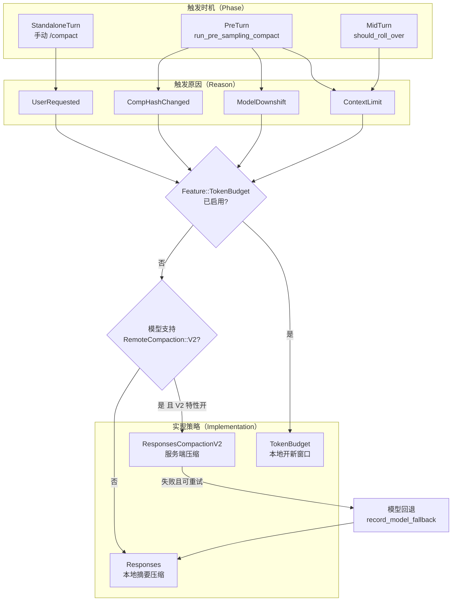
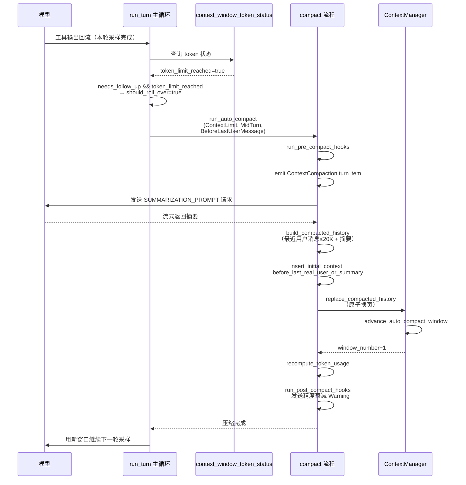

# 04 · 专题深潜 —— 上下文工程与压缩全景剖析

> 三维度深度解读 · 专题篇
> 认知目标：**吃透** —— 把第二篇第 3 章的"续命术"展开成一门完整的学科：上下文如何构成、如何计量、何时压缩、如何压缩、压缩后如何重建
> 前置阅读：建议先读[第二篇 · 具体观](./02-具体观-算法与实现剖析.md)第 3 章建立直觉
> 本文体例：**"论文原理 → 代码实现 → 具体例子"** 三段式 + 全景图（Mermaid），所有代码引用均给出真实文件锚点

---

## 导读：为什么值得为"上下文"单独写一篇

如果说 Agent 主循环是 Codex 的心脏，那么**上下文工程就是它的血液系统**：每一轮推理都要把"模型能看见的一切"打包成一次请求；每一次工具调用的结果都要回流进这条血液。长会话的死亡方式只有一种——上下文超出模型窗口，而 Codex 给出的答案是一套完整的"代谢系统"：

1. **构成**（第 2 章）：模型可见上下文不是一串聊天记录，而是"基础指令 + 世界状态 + 结构化历史"的三层装配；
2. **计量**（第 3 章）：token 不是数出来的，是"服务端账单 + 客户端估算"的混合会计制度；
3. **压缩**（第 4 章）：不是单一的 `/compact` 命令，而是"触发原因 × 触发时机 × 实现策略"的三维决策矩阵，背后有 4 种触发理由、3 个触发时机、3 种实现路径。

本文将逐一拆解这三个层次，最后用一次完整的长会话生命周期把所有机制串起来。

---

## 第一章 认知框架：上下文工程的理论地基

### 1.1 四篇论文撑起一门学科

**[Lost in the Middle: How Language Models Use Long Contexts](https://arxiv.org/abs/2307.03172)**（Liu et al., TACL 2024）
用控制实验证明：模型对上下文信息的利用呈 **U 形曲线**——开头与结尾的信息利用最好，埋在中间的信息被显著忽略。这宣判了"无限堆上下文"的死刑，也解释了 Codex 压缩后为什么把摘要放在**新窗口的开头**：把沉入中部谷底的关键信息捞回头部峰值区。

**[MemGPT: Towards LLMs as Operating Systems](https://arxiv.org/abs/2310.08560)**（Packer et al., 2023）
提出"LLM 即操作系统"的隐喻：把 LLM 的上下文窗口当作**主存**，把外部存储当作**磁盘**，通过分页（paging）机制在两者之间搬运信息——上下文满了就把旧页换出（summarize + evict），需要时再换入（recall）。Codex 的"窗口（window）"一词直接继承了这个隐喻：每次压缩都是一次"换页"，`advance_auto_compact_window` 就是页表指针的前进。

**[Efficient Memory Management for Large Language Model Serving with PagedAttention](https://arxiv.org/abs/2309.06180)**（Kwon et al., SOSP 2023）
虽然讲的是 KV 缓存的物理分块，但它确立了一条工程公理：**上下文的物理布局必须允许前缀共享与原地更新**。这条公理在应用层的投影，就是"提示缓存（prompt caching）友好"——前缀必须稳定，改写历史等于缓存全量失效。Codex 中"合成输出 ID 必须确定性生成"（见 2.5 节）正是为了让规范化过程可以重放而不打破缓存。

**提示缓存经济学**（OpenAI / Anthropic 的商业实践）
缓存命中的输入 token 价格通常只有未命中的 10%–25%。这把"保持前缀稳定"从性能建议升级成了**成本铁律**——仓库 [AGENTS.md](file:///workspace/AGENTS.md) 中"模型可见上下文禁止历史重写、避免频繁变更导致缓存未命中"两条军规的直接来源。

### 1.2 落进仓库的六条军规

[AGENTS.md](file:///workspace/AGENTS.md) 的 "Model visible context" 一节，是上述论文思想的工程化表述，值得逐条对照：

| 军规 | 学术出处 | 在代码中的落点 |
|---|---|---|
| 1. 禁止历史重写，上下文必须增量构建 | PagedAttention 前缀共享 | `record_items` 只追加，`replace_annotated` 仅限压缩/回滚 |
| 2. 避免导致缓存未命中 的频繁变更 | 提示缓存经济学 | 合成 ID 确定性生成（normalize.rs） |
| 3. 所有注入项必须有界且有硬上限 | MemGPT 有界主存 | 各 fragment 的 token 上限常量 |
| 4. 单项不得超过 10K token | Lost in the Middle | `MAX_RETAINED_AGENT_MESSAGE_TOKENS = 10_000` |
| 5. 超过 1K token 的新单项标记为 P0 评审 | 成本控制 | 压缩摘要的 `COMPACT_USER_MESSAGE_MAX_TOKENS = 20_000` 预算 |
| 6. 所有片段必须是 `core/context` 中的结构体并实现 `ContextualUserFragment` | ——（纯工程约束） | [context-fragments/src/fragment.rs](file:///workspace/codex-rs/context-fragments/src/fragment.rs) |

---

## 第二章 上下文的解剖学：模型到底"看见"什么

### 2.1 论文原理 → 一次请求的上下文三层装配

从模型视角看，每次推理请求的 `Prompt` 由两部分组成（见 [core/src/compact.rs](file:///workspace/codex-rs/core/src/compact.rs) L277-L281）：

```rust
let prompt = Prompt {
    input: turn_input,                          // 历史层：规范化后的 ResponseItem 序列
    base_instructions: sess.get_base_instructions().await,  // 指令层：系统提示词
    ..Default::default()
};
```

而"历史层"内部其实又分两层：

```text
┌────────────────────────────────────────────────┐
│ Prompt                                          │
│ ┌────────────────────────────────────────────┐ │
│ │ ① 指令层 base_instructions                 │ │  ← 模型人格 + 模型专属指令（get_model_instructions）
│ ├────────────────────────────────────────────┤ │
│ │ ② 状态层 初始上下文 / 世界状态 diff          │ │  ← 环境变量、权限、AGENTS.md、工具列表…
│ │    （以 developer/user 消息片段形式存在）      │ │     实现 ContextualUserFragment
│ ├────────────────────────────────────────────┤ │
│ │ ③ 对话层 结构化历史 items                   │ │  ← 用户消息 / Agent 消息 / 工具调用 / 输出
│ │    （ResponseItemEnvelope，带 harness 元数据）│ │     唯一允许"只追加"的层
│ └────────────────────────────────────────────┘ │
└────────────────────────────────────────────────┘
```

### 2.2 代码实现：ContextManager——上下文的单一事实来源

[core/src/context_manager/history.rs](file:///workspace/codex-rs/core/src/context_manager/history.rs) L44-L65 定义了这五个字段：

```rust
pub(crate) struct ContextManager {
    /// 最老的项在向量开头。快照共享同一向量，直到调用方需要修改，
    /// 避免只读消费者深拷贝。
    items: Arc<Vec<ResponseItemEnvelope>>,
    /// 每当历史被重写（如压缩或回滚）时递增。
    history_version: u64,
    token_info: Option<TokenUsageInfo>,
    /// 用于 diff 和产出模型可见设置更新项的参考上下文快照。
    reference_context_item: Option<TurnContextItem>,
    /// 最近一次追加到模型可见历史的世界状态。
    world_state_baseline: Option<WorldStateSnapshot>,
}
```

设计要点：

- **`Arc<Vec<...>>` 写时复制**：`clone_history()` 是 O(1) 的快照共享，只有 `Arc::make_mut` 触发修改时才深拷贝——这让"并发读历史 + 偶尔压缩重写"的成本模型非常便宜；
- **`history_version`**：重写历史的合法途径只有压缩与回滚，每次重写版本号 +1（L292-L296），供下游检测"历史已变"；
- **`reference_context_item`**：状态层的 diff 基线。`None` 意味着下一轮必须**全量重注入**初始上下文而不是增量 diff（压缩后正是主动置 `None`，见 4.5 节）；
- **`world_state_baseline`**：世界状态的 diff 基线，配合 `update_world_state` 产出增量片段。

### 2.3 WorldState：十六个 section 的"世界状态"

[core/src/context/world_state/mod.rs](file:///workspace/codex-rs/core/src/context/world_state/mod.rs) L1-L18 列出了全部 section 模块：`agents_md`、`apps_instructions`、`collaboration_mode`、`compact_permissions`、`context_window_guidance`、`environment`、`environments_instructions`、`managed_developer_instructions`、`model`、`multi_agent_mode`、`multi_agent_usage_hint`、`permissions`、`personality`、`plugins_instructions`、`realtime`、`tools`。

每个 section 实现统一的类型化 diff 协议（L56-L69 的 `ErasedWorldStateSection` trait）：

```rust
trait ErasedWorldStateSection: Send + Sync {
    fn snapshot(&self) -> Option<Value>;                       // 可持久化快照
    fn matches_legacy_fragment(&self, role: &str, text: &str) -> bool;
    fn matches_retained_fragment(&self, role: &str, text: &str) -> bool;
    fn render_diff(
        &self,
        previous: PreviousSectionState<'_, Value>,
    ) -> Option<Box<dyn ContextualUserFragment>>;              // 相对上次快照的增量
}
```

关键机制是 `PreviousSectionState` 三态（L196-L204）：`Absent`（无历史快照→全量渲染）、`Unknown`（有片段但快照不可用→保守处理）、`Known`（精确 diff）。渲染出的 diff 经 [history.rs](file:///workspace/codex-rs/core/src/context_manager/history.rs) L123-L140 的 `update_world_state` 落进历史：

```rust
pub(crate) fn update_world_state(
    &mut self,
    world_state: &WorldState,
) -> (Vec<Box<dyn ContextualUserFragment>>, Option<WorldStateItem>) {
    let snapshot = world_state.snapshot();
    let fragments =
        world_state.render_history_diff(self.world_state_baseline.as_ref(), self.raw_items());
    let rollout_item = self.world_state_baseline.as_ref().map_or_else(
        || Some(WorldStateItem::full(snapshot.clone().into_object())),   // 首次：全量
        |previous| {
            snapshot
                .merge_patch_from(previous)                              // 之后：merge-patch
                .map(WorldStateItem::patch)
        },
    );
    self.world_state_baseline = Some(snapshot);
    (fragments, rollout_item)
}
```

这就是"军规 1（增量构建）"的落点：**世界状态从不整段重发，只发 JSON merge-patch 增量**；快照与 diff 基线一一对应，回放时可以精确重建模型当时看见了什么。

### 2.4 ContextualUserFragment：带指纹的上下文片段

所有注入模型上下文的片段必须实现 [context-fragments/src/fragment.rs](file:///workspace/codex-rs/context-fragments/src/fragment.rs) L14-L87 的 trait：

```rust
pub trait ContextualUserFragment {
    fn role(&self) -> &'static str;
    fn requires_separate_message(&self) -> bool { false }
    fn markers(&self) -> (&'static str, &'static str);   // 开始/结束标记
    fn body(&self) -> String;
    fn type_markers() -> (&'static str, &'static str) where Self: Sized;
    fn matches_text(text: &str) -> bool where Self: Sized { /* 前后缀匹配 */ }
    fn render(&self) -> String { format!("{start_marker}{body}{end_marker}") }
    fn into(self) -> ResponseItem { /* 包装成 Message */ }
}
```

两个精妙之处：

1. **标记即指纹**：每个片段渲染时被 start/end marker 包裹，`matches_text` 用大小写不敏感的前后缀匹配（L89-L103）识别"这段文本是我曾经注入的"。这样压缩、回滚、恢复会话时，系统能准确区分"机器注入的上下文"和"人类真实发言"——[core/src/context/contextual_user_message.rs](file:///workspace/codex-rs/core/src/context/contextual_user_message.rs) L18-L31 用一个 `CONTEXTUAL_USER_FRAGMENT_MATCHERS` 函数表罗列了全部 12 类可识别片段（用户指令、环境状态、技能提示、shell 命令、turn 中止通知、子代理通知……）。
2. **`requires_separate_message`**：控制片段是独立成消息还是可合并进同一条 developer 消息，直接影响请求条数与缓存粒度。

### 2.5 历史规范化：normalize 的三条不变量

发给模型前，历史必须通过 [core/src/context_manager/normalize.rs](file:///workspace/codex-rs/core/src/context_manager/normalize.rs) 的规范化，它维护三条不变量：

**不变量 1：每个工具调用必须有输出**（`ensure_call_outputs_present`，L21-L138）
FunctionCall / LocalShellCall / ToolSearchCall / CustomToolCall 若找不到对应输出，就在调用**紧后面**插入一条合成输出 `"aborted"`。模型 API 会拒绝"有调用无输出"的请求，这条不变量保证中断的 turn 也能合法重放。

**不变量 2：没有孤儿输出**（`remove_orphan_outputs`，L155 起）
反向检查：输出若找不到调用方，删除之。

**不变量 3：合成 ID 必须确定**（`synthetic_output_id`，L140-L153）

```rust
/// 从源调用的 item ID 派生稳定的 prompt-only 输出 ID。
/// prompt 规范化可能反复运行而不持久化其合成输出，
/// 所以命名空间和格式必须在重试与恢复之间保持稳定，
/// 以保留 prompt-cache 复用。
fn synthetic_output_id(prefix: &str, item_id: Option<&str>) -> Option<ResponseItemId> {
    let name = format!("{prefix}:{source_id}");
    Some(ResponseItemId::with_suffix(
        prefix,
        Uuid::new_v5(&SYNTHETIC_OUTPUT_ID_NAMESPACE, name.as_bytes()),  // UUIDv5 = 确定性
    ))
}
```

注意 L18 的注释：*"Changing this value would change model-visible IDs and invalidate prompt caches."* —— 连 UUID 命名空间都被冻结成常量，因为改了它 = 全球所有用户的缓存同时失效。这是"军规 2"最极端的体现。

此外，规范化还会按 `input_modalities` 剥离模型不支持的图像/音频内容（替换为占位文本，L14-L17 的两个常量）。

### 2.6 Token 计量：一套混合会计制度

Codex 从不本地跑 tokenizer，而是采用"**服务端账单 + 客户端估算**"的混合制度（[history.rs](file:///workspace/codex-rs/core/src/context_manager/history.rs) L415-L432）：

```rust
pub(crate) fn get_total_token_usage(&self, server_reasoning_included: bool) -> i64 {
    let last_tokens = /* 服务端最近一次上报的 total_tokens */;
    let items_after_last_model_generated_tokens = /* 本地新增项的估算 */;
    if server_reasoning_included {
        last_tokens.saturating_add(items_after_last_model_generated_tokens)
    } else {
        last_tokens
            .saturating_add(self.get_non_last_reasoning_items_tokens())  // 历史里的加密 reasoning
            .saturating_add(items_after_last_model_generated_tokens)
    }
}
```

三层结构：

| 层 | 来源 | 何时变化 |
|---|---|---|
| `last_token_usage.total_tokens` | 服务端 `response.completed` 的权威账单 | 每次模型响应后 `update_token_info` |
| 非末尾 reasoning 项 | 客户端对历史中加密 `Reasoning` 项的估算 | `server_reasoning_included=false` 时补记 |
| 本地新增项 | `approx_token_count`（基于字节的启发式）估算工具输出等 | 工具执行后立即增长 |

`estimate_token_count_with_base_instructions`（L257-L271）则给出"系统提示词 + 全部历史"的完整估算，用于显示和预判。**核心哲学：宁可粗略但即时（工具输出一回来就计入），也不要精确但滞后（等下次请求才知道爆了）。**

---

## 第三章 Token 预算与窗口判定：何时该压缩

### 3.1 论文原理

MemGPT 的换页触发器是"主存占用逼近上限"；操作系统的经典解法是**预留水线（watermark）**——不到 100% 满就启动换页，给突发流量留缓冲。Codex 的 `context_window_token_status` 就是水线机制的实现。

### 3.2 代码实现：context_window_token_status

[core/src/session/context_window.rs](file:///workspace/codex-rs/core/src/session/context_window.rs) L23-L91 的完整判定逻辑：

```rust
pub(crate) async fn context_window_token_status(
    sess: &Session,
    turn_context: &TurnContext,
) -> ContextWindowTokenStatus {
    let active_context_tokens = sess.get_total_token_usage().await;

    // 按 Total 或 BodyAfterPrefix 两种口径计算 scope 内 token
    let (auto_compact_scope_tokens, auto_compact_scope_limit, auto_compact_window_prefill_tokens) =
        match turn_context.config.model_auto_compact_token_limit_scope {
            AutoCompactTokenLimitScope::Total => (
                active_context_tokens,
                turn_context.model_info.auto_compact_token_limit(),
                None,
            ),
            AutoCompactTokenLimitScope::BodyAfterPrefix => {
                let window = sess.auto_compact_window_snapshot().await;
                let baseline = window.prefill_input_tokens.unwrap_or(active_context_tokens);
                (
                    active_context_tokens.saturating_sub(baseline),  // 扣除前缀基线
                    scope_limit,
                    window.prefill_input_tokens,
                )
            }
        };

    let full_context_window_limit = turn_context.model_context_window();  // 模型硬上限

    // 只在有 fallback 缓冲配置时才预留缓冲
    let auto_compact_fallback_buffer_tokens = turn_context
        .config.token_budget
        .as_ref()
        .map_or(0, crate::config::TokenBudgetConfig::fallback_buffer_tokens);
    let buffered_auto_compact_limit = auto_compact_scope_limit
        .map(|limit| limit.saturating_add(auto_compact_fallback_buffer_tokens));

    // 触发判定：达到"含缓冲的软上限"或"模型硬上限"
    let full_context_window_limit_reached =
        full_context_window_limit.is_some_and(|limit| active_context_tokens >= limit);
    let token_limit_reached = buffered_auto_compact_limit
        .is_some_and(|limit| auto_compact_scope_tokens >= limit)
        || full_context_window_limit_reached;
    // ...
}
```

**三种上限的层级关系**：

```text
0 ──────────── auto_compact_scope_limit ──── +fallback_buffer ──── full_context_window
                      │                            │                      │
                      │   软上限：常规自动压缩线        │   缓冲后的触发线        │   硬上限：模型物理边界
                      ▼                            ▼                      ▼
                 （UI 提醒区）              token_limit_reached=true   二次保险，必触发
```

两种计量口径（`AutoCompactTokenLimitScope`）对应两种产品哲学：
- **Total**：整个上下文算一个池子，简单直接；
- **BodyAfterPrefix**：扣除本窗口 prefill 前缀后只计"对话本体"——适合前缀（系统提示 + 初始上下文）巨大且基本不动的场景，压缩只关心增量部分。

### 3.3 窗口管理：AutoCompactWindowIds

[core/src/state/session.rs](file:///workspace/codex-rs/core/src/state/session.rs) L215-L219：

```rust
pub(crate) fn start_new_context_window(&mut self) -> (u64, AutoCompactWindowIds) {
    let window = self.auto_compact_window.advance();
    self.auto_compact_window.clear_prefill();
    window
}
```

每个窗口有递增的 `window_number` 和三元组 ID（`first_window_id` / `previous_window_id` / `window_id`），会随 `CompactedItem` 持久化进 rollout（见 4.5 节）。恢复会话时 `restore_auto_compact_window`（L195-L201）能精确接续窗口谱系——这正是 MemGPT"页表"的应用层版本：**窗口号 = 页号，replace_compacted_history = 换页**。

### 3.4 事件驱动的 UI 联动

`EventMsg::TokenCount` 持续把 token 用量推给前端，TUI 的上下文用量指示条由此驱动。用户看到逼近红线，可以主动 `/compact`——这构成了"人肉水线"，与 3.2 的自动水线互为补充。

---

## 第四章 压缩机制全景：三维决策矩阵与三条实现路径

### 4.1 触发的三维：Trigger × Reason × Phase

压缩不是一个函数，而是一个决策矩阵。[codex-analytics](file:///workspace/codex-rs) 中定义了三个正交维度：

**维度一：Trigger（谁发起）**
- `Manual`：用户输入 `/compact`
- `Auto`：系统自动触发

**维度二：Reason（为什么）**（[compact_model_fallback.rs](file:///workspace/codex-rs/core/src/compact_model_fallback.rs) L30-L35）

| Reason | 含义 | 典型场景 |
|---|---|---|
| `UserRequested` | 用户主动 | `/compact` 命令 |
| `ContextLimit` | 上下文超限 | 水线判定 `token_limit_reached` |
| `ModelDownshift` | 换小窗口模型 | 用户从 400k 窗口模型切到 200k，旧上下文装不下 |
| `CompHashChanged` | 压缩兼容哈希变了 | 模型升级后压缩格式不兼容，旧历史必须重压 |

**维度三：Phase（何时）**
- `StandaloneTurn`：独立压缩轮（手动 `/compact` 作为一轮特殊 turn 执行）
- `PreTurn`：采样前压缩（[turn.rs](file:///workspace/codex-rs/core/src/session/turn.rs) L1011-L1041 的 `run_pre_sampling_compact`）
- `MidTurn`：轮中压缩（[turn.rs](file:///workspace/codex-rs/core/src/session/turn.rs) L458-L498）

**图 4-1：压缩触发的三维决策全景**



### 4.2 PreTurn 与 MidTurn 的分界

**PreTurn**（采样前，[turn.rs](file:///workspace/codex-rs/core/src/session/turn.rs) L1011-L1041）先做两件事：

```rust
async fn run_pre_sampling_compact(/* ... */) -> CodexResult<()> {
    maybe_run_previous_model_inline_compact(sess, turn_context, client_session, cancellation_token).await?;
    let token_status = context_window_token_status(sess.as_ref(), turn_context.as_ref()).await;
    if token_status.token_limit_reached {
        run_auto_compact(/* ..., InitialContextInjection::DoNotInject,
                           CompactionReason::ContextLimit, CompactionPhase::PreTurn */).await?;
    }
    Ok(())
}
```

其中 `maybe_run_previous_model_inline_compact`（L1080-L1171）处理两种模型切换场景：
- **CompHashChanged**（L1089-L1122）：上一轮模型的压缩兼容哈希与当前模型不同 → 用**旧模型**的 turn context 先压缩再切换（保证压缩提示词与旧上下文兼容）；
- **ModelDownshift**（L1124-L1169）：新旧模型都已知窗口且新窗口更小、当前 token 已超新窗口 → 同样先用旧模型压缩。

两条路径都准备好 `fallback_step_context`：若旧模型压缩失败且错误属于"可能模型相关"（[compact_model_fallback.rs](file:///workspace/codex-rs/core/src/compact_model_fallback.rs) L9-L20 的 `should_retry_with_current_model`：InvalidRequest / ContextWindowExceeded / ServerOverloaded 等），就用当前模型重试并记录 `codex.compaction.model_fallback` 遥测。

**MidTurn**（轮中，[turn.rs](file:///workspace/codex-rs/core/src/session/turn.rs) L411-L498）发生在"一次采样 + 工具执行完成之后、决定是否继续下一轮采样之前"：

```rust
let should_roll_over = needs_follow_up
    && (sess.take_new_context_window_request().await || token_limit_reached);
// ...
if should_roll_over {
    run_auto_compact(
        &sess, Arc::clone(&step_context), /*fallback_step_context*/ None,
        &mut client_session,
        InitialContextInjection::BeforeLastUserMessage {   // ← 注意：与 PreTurn 不同！
            world_state: Arc::clone(&world_state),
            step_context: Arc::clone(&step_context),
        },
        CompactionReason::ContextLimit,
        CompactionPhase::MidTurn,
    ).await
    // 压缩后 continue 主循环，继续处理 pending 输入
}
```

`needs_follow_up = model_needs_follow_up || has_pending_input`——只有"还要继续干活"时才压缩；若本轮已经可以收尾，就不必压缩，留给下一轮的 PreTurn 处理。

### 4.3 InitialContextInjection：中轮压缩的模型对齐约束

[core/src/compact.rs](file:///workspace/codex-rs/core/src/compact.rs) L59-L74 的枚举注释值得全文引用：

```rust
/// 控制压缩替换历史是否必须包含初始上下文。
///
/// Pre-turn/手动压缩用 `DoNotInject`：它们用摘要替换历史并清空
/// `reference_context_item`，下一个常规 turn 会在压缩后完整重注入初始上下文。
///
/// Mid-turn 压缩必须用 `BeforeLastUserMessage`，因为模型被训练为
/// 在中轮压缩后把压缩摘要视为历史最后一项；因此我们把初始上下文
/// 注入替换历史中、恰好位于最后一条真实用户消息之上。
pub(crate) enum InitialContextInjection {
    BeforeLastUserMessage { world_state: Arc<WorldState>, step_context: Arc<StepContext> },
    DoNotInject,
}
```

这不是实现细节，而是**模型训练分布的对齐**：服务端模型的训练数据里，中轮压缩后摘要就是最后一项，工程实现必须服从训练分布。两种策略的差异：

| | DoNotInject（PreTurn/手动） | BeforeLastUserMessage（MidTurn） |
|---|---|---|
| 替换历史中含初始上下文? | 否 | 是（插在最后一条真实用户消息前） |
| `reference_context_item` | 置 `None` → 下轮全量重注入 | 设为当前 `TurnContextItem` → 下轮走 diff |
| 压缩后继续执行? | 否，等下一轮 | 是，`continue` 主循环接着采样 |

### 4.4 本地摘要压缩全流程：compact.rs

手动压缩入口（[compact.rs](file:///workspace/codex-rs/core/src/compact.rs) L143-L167）先发 `TurnStarted` 事件——**压缩本身就是一轮 turn**，UI 会显示它的进度。核心在 `run_compact_task_inner_impl`（L240-L394），分五步：

**第一步：组装摘要请求**（L252-L289）
把 `SUMMARIZATION_PROMPT`（[prompts/templates/compact/prompt.md](file:///workspace/codex-rs/prompts/templates/compact/prompt.md)）作为用户输入追加进历史克隆，构造完整 `Prompt` 发给模型。提示词要求生成"交接摘要"：

> You are performing a CONTEXT CHECKPOINT COMPACTION. Create a handoff summary for another LLM that will resume the task. Include: Current progress and key decisions made / Important context, constraints, or user preferences / What remains to be done (clear next steps) / Any critical data, examples, or references needed to continue...

**第二步：流式生成 + 自愈重试**（L271-L345）
`drain_to_completed` 消费流式响应。错误处理有层次：
- `Interrupted / TurnAborted`：直接返回（用户打断）；
- `SessionBudgetExceeded`：报告并终止；
- `ContextWindowExceeded`：**自救机制**——若输入多于 1 项，`history.remove_first_item()` 删最老项重试（保留前缀缓存、保住最近消息）；删无可删才把 token 置满并报错；
- 其他错误：指数退避重试（`stream_max_retries` 次）。

**第三步：构建替换历史**（L347-L359）
```rust
let history_snapshot = sess.clone_history().await;
let summary_suffix = get_last_assistant_message_from_turn(history_snapshot.raw_items()).unwrap_or_default();
let summary_text = format!("{SUMMARY_PREFIX}\n{summary_suffix}");
let user_messages = collect_annotated_user_messages(history_items);
let mut new_history = build_compacted_history(Vec::new(), &user_messages, &summary_text);
```

`SUMMARY_PREFIX`（[prompts/templates/compact/summary_prefix.md](file:///workspace/codex-rs/prompts/templates/compact/summary_prefix.md)）是给**下一个模型**的开场白：

> Another language model started to solve this problem and produced a summary of its thinking process. You also have access to the state of the tools that were used by that language model. Use this to build on the work that has already been done and avoid duplicating work...

`build_compacted_history`（L639-L717）的保留策略是**从新到旧的 20K token 预算内装最近用户消息**：

```rust
fn build_compacted_history_with_limit(/* ..., max_tokens: usize */) {
    let mut remaining = max_tokens;                    // COMPACT_USER_MESSAGE_MAX_TOKENS = 20_000
    for message in user_messages.iter().rev() {        // 倒序：从最新往回装
        if remaining == 0 { break; }
        let tokens = approx_token_count(&message.message);
        if tokens <= remaining {
            selected_messages.push(message.clone());
            remaining = remaining.saturating_sub(tokens);
        } else {
            // 装不下的最后一条截断到剩余预算
            let truncated = truncate_text(&message.message, TruncationPolicy::Tokens(remaining));
            selected_messages.push(/* truncated */);
            break;
        }
    }
    selected_messages.reverse();                       // 恢复时间顺序
    // 依次 push 用户消息，最后 push 摘要（作为 user 消息）
}
```

注意 `is_summary_message`（L567-L569）会跳过历史中的旧摘要——**反复压缩不会产生摘要套娃**。

**第四步：注入初始上下文**（L362-L373）
MidTurn 时调用 `insert_initial_context_before_last_real_user_or_summary`（L581-L637），插入位置的优先级链值得细读：
1. 优先插在**最后一条真实用户/agent 消息**之前（非 FINAL_ANSWER 的 AgentMessage 也算）；
2. 没有真实用户消息 → 插在**摘要**之前（摘要保持最后）；
3. 连用户消息都没有 → 插在最后一个 **Compaction 项**之前（远程压缩可能只返回 compaction 项）；
4. 都没有 → 追加到末尾。

**第五步：替换历史 + 持久化 + 善后**（L374-L393）
调用 `replace_compacted_history`（见下节），然后 `recompute_token_usage` 重算用量、发 `TurnCompleted`、并给用户发一条 Warning："Heads up: Long threads and multiple compactions can cause the model to be less accurate. Start a new thread when possible..."——**工程上诚实告知：压缩是有损的，多次压缩会累积信息损失**。

### 4.5 replace_compacted_history：原子换页

[core/src/session/mod.rs](file:///workspace/codex-rs/core/src/session/mod.rs) L3382-L3431 是"换页"的原子操作：

```rust
pub(crate) async fn replace_compacted_history(
    &self,
    mut items: Vec<ResponseItemEnvelope>,
    reference_context_item: Option<TurnContextItem>,
    world_state_baseline: Option<Arc<WorldState>>,
    metadata: CompactedHistoryMetadata,
) {
    for envelope in &mut items {
        Self::assign_missing_response_item_id(&mut envelope.item);   // 补齐缺失 ID
    }
    let compacted_item = CompactedItem {
        message: metadata.message,
        replacement_history: Some(items.clone()),      // 替换历史整体持久化
        mcp_resource_origins: self.services.mcp_runtime.resource_origin_checkpoint(),
        window_number: Some(metadata.window_number),
        first_window_id: Some(metadata.window_ids.first_window_id.to_string()),
        previous_window_id: metadata.window_ids.previous_window_id.map(|id| id.to_string()),
        window_id: Some(metadata.window_ids.window_id.to_string()),
    };
    // 压缩开启新历史窗口，WorldState 基线必须是全量
    {
        let mut state = self.state.lock().await;
        state.replace_annotated_history(items, reference_context_item.clone());
        if let Some(world_state) = world_state_baseline {
            let snapshot = world_state.snapshot();
            world_state_item = Some(WorldStateItem::full(snapshot.clone().into_object()));
            state.history.set_world_state_baseline(snapshot);
        }
    }
    // 持久化顺序：Compacted → WorldState → TurnContext
    self.persist_rollout_items(&[RolloutItem::Compacted(compacted_item)]).await;
    if let Some(world_state_item) = world_state_item {
        self.persist_rollout_items(&[RolloutItem::WorldState(world_state_item)]).await;
    }
    if let Some(turn_context_item) = reference_context_item {
        self.persist_rollout_items(&[RolloutItem::TurnContext(turn_context_item)]).await;
    }
    // 排队触发 SessionStartSource::Compact 的 session-start hooks
    state.queue_pending_session_start_source(codex_hooks::SessionStartSource::Compact);
}
```

要点：
- **持久化的三段顺序**（替换历史 → 全量世界状态 → 参考上下文）保证 rollout 重放时能精确重建"压缩后模型看见了什么"；
- `CompactedItem.replacement_history` 保存**完整替换历史**，恢复会话直接采用，无需重新压缩；
- 压缩后排队 `SessionStartSource::Compact` hook——扩展可以借机感知"新窗口开始了"。

### 4.6 TokenBudget 压缩：不摘要，直接开新窗口

[core/src/compact_token_budget.rs](file:///workspace/codex-rs/core/src/compact_token_budget.rs) L21-L64 是另一种哲学：**跳过模型摘要，直接安装全新上下文窗口**。

```rust
/// 将 token-budget 手动压缩作为正常压缩生命周期运行。
/// Token-budget 压缩跳过模型/服务端摘要，改为安装一个全新的上下文窗口。
/// 它仍被建模为压缩，因此 compact hooks 与 `ContextCompaction` turn item
/// 观察到与本地或远程压缩相同的生命周期。
pub(crate) async fn run_manual_compact_task(/* ... */) -> CodexResult<()> { /* ... */ }
```

核心三步（L66-L93）：pre-compact hooks → `sess.start_new_context_window(step_context, world_state)` → post-compact hooks。而 `start_new_context_window`（[session/mod.rs](file:///workspace/codex-rs/core/src/session/mod.rs) L3798-L3847）会：

1. （可选）保留 client-authored developer 消息，截断到 `RETAINED_MESSAGE_TOKEN_BUDGET = 64_000` token；
2. 推进窗口号、清空 prefill 基线；
3. 用当前 world state **全量重建**初始上下文（不复用旧历史的任何部分）；
4. 以空 `message` 的 `CompactedHistoryMetadata` 走 `replace_compacted_history`。

这条路径的适用场景：世界状态本身已经足够"自描述"（AGENTS.md、环境、权限都在初始上下文里），对话流水线的边际价值低——重开一页比蒸馏旧页更便宜也更准确。

### 4.7 远程压缩 V2：把蒸馏交给服务端

[core/src/compact_remote_v2.rs](file:///workspace/codex-rs/core/src/compact_remote_v2.rs) 的路径在模型支持 `RemoteCompactionSupport::V2` 且特性开启时生效。两个关键常量（L63-L69）：

```rust
pub(crate) const RETAINED_MESSAGE_TOKEN_BUDGET: usize = 64_000;   // 保留消息总预算
const MAX_RETAINED_AGENT_MESSAGE_TOKENS: i64 = 10_000;            // 单条 agent 消息上限（军规 4！）
const MAX_REMOTE_COMPACTION_V2_STREAM_RETRIES: u64 = 2;           // 压缩请求重试预算更小
```

服务端压缩的好处：蒸馏发生在服务端，可以访问模型的内部训练对齐的压缩格式；失败时回退链完整（`record_model_fallback` 打点 → 本地 Responses 压缩兜底）。它复用了本地压缩的 `insert_initial_context_before_last_real_user_or_summary` 与 `replace_compacted_history`——**三条实现路径在"换页落盘"这一步完全收敛**。

### 4.8 遥测：压缩可观测性

每次压缩都通过 `CompactionAnalyticsAttempt`（[compact.rs](file:///workspace/codex-rs/core/src/compact.rs) L396-L484）上报 `CodexCompactionEvent`：触发/原因/实现/阶段/策略、压缩前后 token 数、保留图片数、摘要 token 数、缓存命中 token 数、耗时……这套数据支撑了 `strategy: CompactionStrategy::Memento` 的线上质量监控——压缩不只是功能，更是被持续度量的系统。

---

## 第五章 具体例子：一次长会话的完整生命周期

### 5.1 场景设定

用户让 Codex 修一个跨 5 个文件的重构 bug。会话进行到第 40 轮，上下文 152K token，模型窗口 200K，auto_compact 软上限 140K + 8K 缓冲。

### 5.2 时间线推演

```text
第 38 轮末：token=135K（Total 口径）
  └─ context_window_token_status: token_limit_reached = false
     base_window_tokens_remaining = min(148K-135K, 200K-135K) = 13K
  └─ TokenCount 事件 → TUI 用量条变黄

第 39 轮：模型读了 3 个大文件，工具输出 12K token
  └─ token=152K ≥ 148K（含缓冲上限）→ token_limit_reached = true
  └─ MidTurn 检查：needs_follow_up=true（还有 pending 输入）
     → run_auto_compact(Reason=ContextLimit, Phase=MidTurn,
                        Injection=BeforeLastUserMessage)
     → 若 TokenBudget 特性开 → 开新窗口（世界状态全量重注入）
     → 否则模型生成"交接摘要"
     → 替换历史 = [最近用户消息(≤20K)] + [SUMMARY_PREFIX+摘要]
     → 初始上下文插在最后一条真实用户消息前
     → replace_compacted_history 落盘 CompactedItem(window_number+1)
     → recompute_token_usage → token 回落到 ~30K
     → continue 主循环处理剩余 pending 输入（无缝继续）

（另一种时间线：第 39 轮模型自然收尾，needs_follow_up=false）
  └─ 不压缩，等用户下一条输入
  └─ 下一条输入进来 → run_pre_sampling_compact
     → token_limit_reached=true → PreTurn 压缩（DoNotInject）
     → reference_context_item 置 None → 本轮全量重注入初始上下文

（第三种时间线：用户中途 /model 切到小窗口模型）
  └─ 下一轮 PreTurn 的 maybe_run_previous_model_inline_compact
     → old_window=400K > new_window=200K 且 152K ≥ 200K? 否——不触发
     → 若 token=250K ≥ 200K → ModelDownshift 压缩（先用旧模型压）
```

**图 5-1：中轮自动压缩完整时序**



### 5.3 压缩前后：模型上下文的物理对比

```text
压缩前（152K token）                       压缩后（~30K token）
┌──────────────────────────┐              ┌──────────────────────────┐
│ base_instructions        │              │ base_instructions        │
│ 初始上下文(40轮前的旧版)   │   ──换页──▶   │ 初始上下文(当前最新版)      │
│ 用户消息×40              │              │ 最近用户消息(≤20K token)   │
│ Agent消息×40             │              │ SUMMARY_PREFIX + 交接摘要  │
│ 工具调用×120             │              │ （user 角色，位于历史末尾）  │
│ 工具输出×120（含大文件）   │              └──────────────────────────┘
│ 旧摘要(第20轮压缩的)      │               关键差异：
└──────────────────────────┘               · 世界状态 diff 基线重置为全量
                                           · reference_context_item 指向新快照
                                           · 旧摘要被 is_summary_message 跳过（不套娃）
                                           · 窗口号 +1，页表前进
```

---

## 第六章 设计哲学：把机制升华成原则

### 6.1 与操作系统虚拟内存的完整类比

| OS 概念 | Codex 对应物 | 代码锚点 |
|---|---|---|
| 物理内存 | 模型上下文窗口 | `model_context_window()` |
| 页 | 上下文窗口（window） | `AutoCompactWindowIds` |
| 页表前进 | `advance_auto_compact_window` | [state/session.rs](file:///workspace/codex-rs/core/src/state/session.rs) L203 |
| 缺页中断 | `token_limit_reached` | [context_window.rs](file:///workspace/codex-rs/core/src/session/context_window.rs) |
| 换页（page out） | 压缩（摘要 + 蒸馏） | compact.rs / compact_remote_v2.rs |
| 页面丢弃（drop） | TokenBudget 开新窗口 | compact_token_budget.rs |
| 驻留集（working set） | 保留的最近用户消息（20K） | `COMPACT_USER_MESSAGE_MAX_TOKENS` |
| 磁盘交换区 | rollout 持久化的完整历史 | `CompactedItem.replacement_history` |
| 水线（watermark） | 软上限 + fallback 缓冲 | `fallback_buffer_tokens` |

区别于 OS 的一点：Codex 的"换出"是**有损蒸馏**而非无损搬运——这正是 4.4 节末尾那条 Warning 的由来，也是第 2 章 U 形曲线的代价转嫁：宁可承受一次蒸馏损失，也不要让信息沉入中部谷底永久失效。

### 6.2 缓存友好的增量主义

整套系统对"前缀稳定"的执念贯穿始终：

1. 历史只追加（军规 1），重写只发生在压缩这一唯一闸口；
2. 合成 ID 用 UUIDv5 确定性生成，规范化可无限重放（2.5 节）；
3. 压缩时 `ContextWindowExceeded` 的自救是 `remove_first_item`（删最老），保前缀缓存；
4. 世界状态走 merge-patch 增量，不整段重发（2.3 节）；
5. MidTurn 压缩后 `reference_context_item` 保留 → 下一轮继续 diff 而非全量重注入。

### 6.3 诚实的工程：三条"承认不完美"的设计

- **压缩有损**：主动发 Warning 告知多次压缩降低准确性（compact.rs L389-L392）；
- **估算是粗略下界**：`estimate_token_count` 注释直言 "coarse lower bound, not tokenizer-accurate"（history.rs L245-L246）；
- **模型会失败**：压缩专门有模型回退链路与遥测（compact_model_fallback.rs），承认"旧模型压缩可能失败"是一等场景。

### 6.4 三条实现路径的哲学分野

| 路径 | 哲学 | 何时最优 |
|---|---|---|
| 本地 Responses 摘要 | "让模型蒸馏自己" | 无服务端支持；会话流水线信息密度高 |
| 远程 V2 压缩 | "蒸馏是模型厂商的专长" | 服务端有训练对齐的压缩格式 |
| TokenBudget 开新窗 | "世界状态已自描述，旧页不值得抢救" | 初始上下文完备、对话边际价值低 |

三者共享同一套生命周期（hooks / turn item / 持久化 / 遥测）——**策略可替换，协议不可变**。这是插件化架构的教科书示范。

---

## 附录 A：关键文件地图

```text
codex-rs/
├── core/src/
│   ├── compact.rs                    # 本地摘要压缩：触发/重试/替换历史构建
│   ├── compact_token_budget.rs       # TokenBudget 压缩：开新窗口
│   ├── compact_remote.rs             # 远程压缩 V1
│   ├── compact_remote_v2.rs          # 远程压缩 V2（64K 保留预算）
│   ├── compact_model_fallback.rs     # 压缩的模型回退判定与打点
│   ├── context_manager/
│   │   ├── history.rs                # ContextManager：单一事实来源 + token 计量
│   │   └── normalize.rs              # 历史规范化三不变量
│   ├── context/
│   │   ├── contextual_user_message.rs# 上下文片段识别（12 类 matcher）
│   │   └── world_state/              # 16 个 section 的类型化 diff 协议
│   └── session/
│       ├── turn.rs                   # PreTurn/MidTurn 压缩触发点
│       ├── context_window.rs         # token 水线判定
│       └── mod.rs                    # replace_compacted_history / start_new_context_window
├── context-fragments/src/fragment.rs # ContextualUserFragment trait
├── prompts/templates/compact/
│   ├── prompt.md                     # SUMMARIZATION_PROMPT（交接摘要指令）
│   └── summary_prefix.md             # SUMMARY_PREFIX（下一个模型的开场白）
└── core/src/state/session.rs         # 窗口页表（advance/restore）
```

## 附录 B：关键常量速查

| 常量 | 值 | 含义 | 锚点 |
|---|---|---|---|
| `COMPACT_USER_MESSAGE_MAX_TOKENS` | 20 000 | 压缩后保留的最近用户消息预算 | [compact.rs](file:///workspace/codex-rs/core/src/compact.rs) L57 |
| `RETAINED_MESSAGE_TOKEN_BUDGET` | 64 000 | 远程压缩保留消息总预算 | [compact_remote_v2.rs](file:///workspace/codex-rs/core/src/compact_remote_v2.rs) L65 |
| `MAX_RETAINED_AGENT_MESSAGE_TOKENS` | 10 000 | 单条 agent 消息上限（军规 4） | [compact_remote_v2.rs](file:///workspace/codex-rs/core/src/compact_remote_v2.rs) L66 |
| `MAX_REMOTE_COMPACTION_V2_STREAM_RETRIES` | 2 | 远程压缩流重试次数 | [compact_remote_v2.rs](file:///workspace/codex-rs/core/src/compact_remote_v2.rs) L69 |
| `SYNTHETIC_OUTPUT_ID_NAMESPACE` | 冻结的 UUID | 合成输出 ID 命名空间（改了=缓存全失效） | [normalize.rs](file:///workspace/codex-rs/core/src/context_manager/normalize.rs) L19 |

## 附录 C：源码阅读路线（建议顺序）

1. [fragment.rs](file:///workspace/codex-rs/context-fragments/src/fragment.rs) —— 先懂"片段"这个最小单元（10 分钟）；
2. [history.rs](file:///workspace/codex-rs/core/src/context_manager/history.rs) L44-L65 —— 再看 ContextManager 五字段（15 分钟）；
3. [context_window.rs](file:///workspace/codex-rs/core/src/session/context_window.rs) —— 懂何时压缩（10 分钟）；
4. [compact.rs](file:///workspace/codex-rs/core/src/compact.rs) L240-L394 —— 主干压缩流程（30 分钟）；
5. [turn.rs](file:///workspace/codex-rs/core/src/session/turn.rs) L1011-L1171 —— PreTurn 触发与模型切换（20 分钟）；
6. [session/mod.rs](file:///workspace/codex-rs/core/src/session/mod.rs) L3382-L3431 —— 原子换页与持久化（15 分钟）；
7. [normalize.rs](file:///workspace/codex-rs/core/src/context_manager/normalize.rs) —— 缓存友好的细节（15 分钟）；
8. [world_state/mod.rs](file:///workspace/codex-rs/core/src/context/world_state/mod.rs) —— 类型化 diff 协议（20 分钟）。

---

*结语：上下文工程是"把有限窗口用出无限会话"的艺术。Codex 的答案不是某个单点算法，而是一套约束系统——六条军规划定边界，三层装配定义构成，混合会计持续计量，三维矩阵决定时机，三条路径执行换页，一个原子闸口完成替换。每个环节都对"缓存前缀稳定"与"信息有界"这两条公理保持敬畏。这大概就是从"能跑的 demo"到"可靠的工程伙伴"之间，那一整套看不见的代谢系统。*
