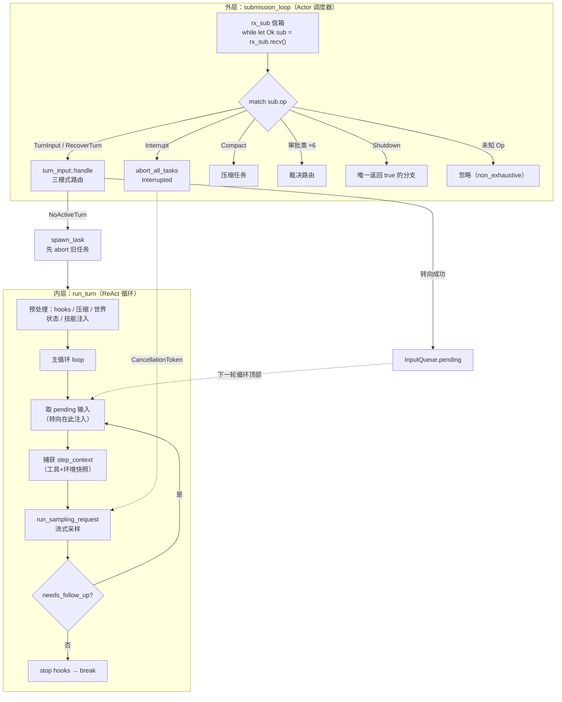
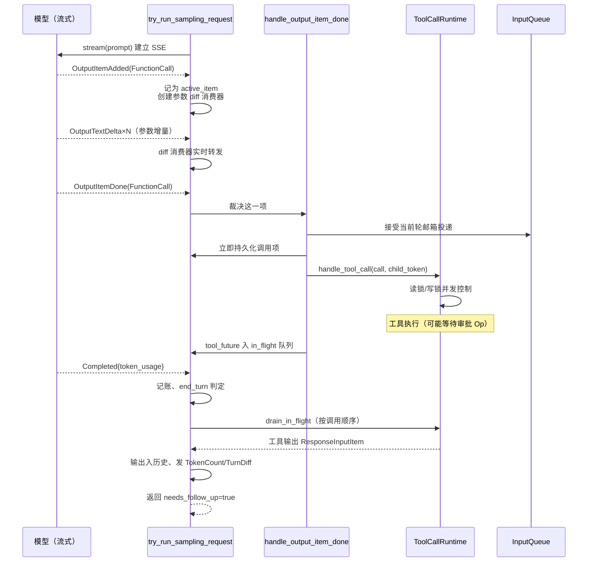

# 05 · 专题深潜 —— Agent 主循环全景剖析

> 三维度深度解读 · 专题篇
> 认知目标：**吃透** —— 把第二篇第 1 章的"ReAct 工程化"展开成完整解剖：外层 Actor 循环如何调度一切，内层 ReAct 循环如何思考与行动，转向如何注入进行中的轮次，中断如何优雅落地
> 前置阅读：建议先读[第二篇 · 具体观](./02-具体观-算法与实现剖析.md)第 1 章建立直觉；本文与[第四篇 · 上下文工程](./04-专题深潜-上下文工程与压缩.md)互为表里——主循环是"心脏"，上下文是"血液"
> 本文体例：**"论文原理 → 代码实现 → 具体例子"** 三段式 + 全景图（Mermaid），所有代码引用均给出真实文件锚点

---

## 导读：为什么"循环"值得单独写一篇

每一个 LLM Agent 的骨架都可以浓缩成一行伪代码：`while not done: think(); act(); observe()`。但把这行伪代码变成**生产级系统**，中间隔着四个致命问题：

1. **并发问题**——模型在思考时用户又发了消息怎么办？审批回复、MCP 请求、压缩命令同时到达怎么办？
2. **中断问题**——用户按 ESC 打断一个正在执行工具的轮次，如何保证历史一致、进程干净、还能恢复？
3. **流式问题**——模型输出是增量到达的，如何在"边收边转发"的同时判断"这是一个工具调用还是最终答复"？
4. **失败问题**——流断在半路、上下文超限、配额耗尽，如何分类处置而不是一刀切崩溃？

Codex 的答案是一套**双层循环架构**：外层 `submission_loop` 是 Actor 模型的消息调度器（单线程、串行、全知），内层 `run_turn` 是 ReAct 范式的思考-行动循环（流式、可转向、可中断）。两层之间靠 `Op` 枚举与 `Event` 事件流解耦。本文将逐层拆解。

---

## 第一章 认知框架：主循环的理论地基

### 1.1 三篇论文撑起一个循环

**[ReAct: Synergizing Reasoning and Acting in Language Models](https://arxiv.org/abs/2210.03629)**（Yao et al., ICLR 2023）
提出"推理轨迹（Thought）与任务行动（Action）交错生成"的通用范式：推理帮助模型跟踪计划、处理异常，行动让模型从外部环境获取真实信息，二者协同显著优于"只推理"或"只行动"，并大幅减少幻觉。ReAct 是内层循环 `run_turn` 的直接蓝图：每次采样请求要么返回工具调用（Action），要么返回助手消息（Thought 的可见形态 + 轮次终点）。

**[SWE-agent: Agent-Computer Interfaces Enable Automated Software Engineering](https://arxiv.org/abs/2405.15793)**（Yang et al., NeurIPS 2024）
证明**接口设计（ACI，Agent-Computer Interface）与模型能力同等重要**：专为语言模型设计的精简动作空间能让同一个模型在真实软件工程任务上表现成倍提升。Codex 的工具协议（`exec_command` 参数、`apply_patch` 文法、`update_plan`）是 ACI 思想的落点——而主循环正是这套 ACI 的"操作系统内核"：它决定工具何时被广告、如何被并发调度、失败如何回报给模型。

**[Efficient Streaming Language Models with Attention Sinks](https://arxiv.org/abs/2309.17453)**（Xiao et al., ICLR 2024）
揭示了流式场景的核心矛盾与解法（注意力锚点 + 滑动窗口）。它解释了为什么主循环必须"流式优先"：用户不能等 30 秒才看到第一个字，Agent 更要在工具调用参数尚未生成完毕时就开始准备执行。Codex 的 `OutputItemAdded` → 增量 delta → `OutputItemDone` 三段式流处理就是为此设计。

### 1.2 一个工程范式：Actor 模型

外层循环的理论原型不是论文，而是 Hewitt 1973 年的 **Actor 模型**：系统由一个个 Actor 组成，每个 Actor 单线程处理自己的信箱（mailbox），消息异步到达、串行处理、永不并发。这个模型用"牺牲并行"换来了"消灭竞态"——Actor 内部的所有状态都不需要锁保护。Codex 把整个 Session 做成一个巨型 Actor：所有操作（`Op`）排队进入 `submission_loop` 串行分派，天然消除了"两个操作同时改历史"这类灾难。

---

## 第二章 外层循环：submission_loop —— Actor 调度器

### 2.1 论文原理 → 一切操作皆为消息

Actor 模型的第一条纪律：**外部世界不能直接调用 Actor 的方法，只能给它发消息**。在 Codex 中，这条纪律的执行者是 [protocol/src/protocol.rs](file:///workspace/codex-rs/protocol/src/protocol.rs) L543 起的 `Op` 枚举——约 26 种操作，构成了 Session 这个 Actor 的完整"指令集"：

| 类别 | Op 变体 | 用途 |
|---|---|---|
| **输入类** | `TurnInput`、`RecoverTurn`、`InterAgentCommunication` | 用户输入、恢复中断轮、子代理消息 |
| **审批类** | `ExecApproval`、`PatchApproval`、`UserInputAnswer`、`RequestPermissionsResponse`、`DynamicToolResponse`、`ResolveElicitation` | 六种"等待用户/外部裁决"的回复通道 |
| **控制类** | `Interrupt`、`CleanBackgroundTerminals`、`Shutdown` | 打断、清理后台终端、关机 |
| **维护类** | `Compact`、`ThreadRollback`、`ThreadSettings`、`SetThreadMemoryMode`、`ReloadUserConfig`、`RefreshMcpServers` | 压缩、回滚、改设置、刷新 MCP |
| **扩展类** | `Review`、`ApproveGuardianDeniedAction`、`RunUserShellCommand`、Realtime 系列 ×6 | 代码审查、守护审批、`!cmd`、语音会话 |

### 2.2 代码实现：一百行的"操作系统内核"

[core/src/session/handlers.rs](file:///workspace/codex-rs/core/src/session/handlers.rs) L515-L693 是整个 Codex 最重要的一百多行：

```rust
pub(super) async fn submission_loop(
    sess: Arc<Session>,
    config: Arc<Config>,
    rx_sub: Receiver<Submission>,
) {
    // To break out of this loop, send Op::Shutdown.
    let mut shutdown_received = false;
    while let Ok(sub) = rx_sub.recv().await {
        debug!(?sub, "Submission");
        let dispatch_span = submission_dispatch_span(&sub);
        let should_exit = async {
            match sub.op {
                Op::Interrupt => { interrupt(&sess).await; false }
                Op::TurnInput { request, mode, reply } => {
                    let result = turn_input::handle(&sess, *request, mode, sub.id.clone()).await;
                    let _ = reply.send(result);
                    false
                }
                Op::RecoverTurn { thread_settings, reply } => {
                    let result = turn_input::handle_recovery(&sess, thread_settings, sub.id.clone()).await;
                    let _ = reply.send(result);
                    false
                }
                Op::Compact => { compact(&sess, sub.id.clone()).await; false }
                Op::Shutdown => shutdown(&sess, sub.id.clone()).await,
                // ... 其余约二十种操作
                _ => false, // Ignore unknown ops; enum is non_exhaustive to allow extensions.
            }
        }
        .instrument(dispatch_span)
        .await;
        if should_exit {
            shutdown_received = true;
            break;
        }
    }
    // 通道关闭而无显式 Shutdown 时，仍执行会话 teardown
    if !shutdown_received {
        shutdown_session_runtime(&sess).await;
        emit_thread_stop_lifecycle(sess.as_ref()).await;
        // ...
    }
    debug!("Agent loop exited");
}
```

六个值得咀嚼的设计决策：

1. **`while let Ok(sub) = rx_sub.recv().await`**——信箱空则挂起（不烧 CPU），通道关闭则退出循环。Actor 生命周期的教科书写法；
2. **所有分支返回 `false`，唯独 `Op::Shutdown` 走 `shutdown()` 返回 `true`**——"唯一出口"原则，保证关机路径必然收敛；
3. **每个分派都包在一个 tracing span 里**（`submission_dispatch_span`）——可观测性是一等公民，每条消息的分派耗时、trace 上下文都可追溯；
4. **`_ => false` 兜底 + 注释 "enum is non_exhaustive to allow extensions"**——协议向前兼容：老版本内核遇到新版本客户端发来的未知 Op，忽略而非崩溃；
5. **通道意外关闭也要 teardown**（L681-L691）——防御性收尾：即使发送端全部 drop，rollout 持久化与生命周期事件也会完成；
6. **`TurnInput` 与 `RecoverTurn` 带 `reply: oneshot::Sender`**——同步语义搭在异步消息上：调用方 submit 后可以 await 这个 oneshot 拿到"已受理/被拒绝"的裁决，而不必等整个 turn 跑完。

### 2.3 从 Op 到任务：spawn_task 的原子交接

`Op::TurnInput` 被受理后，控制权交给 [core/src/tasks/mod.rs](file:///workspace/codex-rs/core/src/tasks/mod.rs) L279-L289 的 `spawn_task`：

```rust
pub async fn spawn_task<T: SessionTask>(
    self: &Arc<Self>,
    turn_context: Arc<TurnContext>,
    input: Vec<TurnInput>,
    task: T,
) {
    self.abort_all_tasks(TurnAbortReason::Replaced).await;   // ① 新任务替换旧任务
    self.clear_connector_selection().await;
    self.start_task(turn_context, input, task, MailboxParentProvenance::Ignore)
        .await;
}
```

注意 ①：**开始新任务前先中止所有旧任务**（原因标记为 `Replaced`）。这意味着同一时刻一个 Session 只有一个活动 Task——这就是"单活动轮"不变量，后续所有并发设计都建立在它之上。

`start_task`（L291-L432）完成原子交接的其余部分：

```rust
let cancellation_token = CancellationToken::new();
let done = Arc::new(Notify::new());
// ... 取出 pending 输入、绑定 turn_state、发 TurnStarted 生命周期事件
let handle = tokio::spawn(
    async move {
        let task_result = task_for_run
            .run(/* session, ctx, task_input, child_token */)
            .instrument(trace_span!("session_task.run"))
            .await;
        // 任务结束后：flush rollout → 统一走 on_task_finished 生命周期
        if let Err(err) = sess.flush_rollout().await { /* 告警但继续 */ }
        if !task_cancellation_token.is_cancelled() {
            sess.on_task_finished(Arc::clone(&ctx_for_finish), task_result).await;
        }
        done_clone.notify_waiters();
    }
    .instrument(task_span),   // 带 token_usage 字量的 info_span!("turn")
);
let running_task = RunningTask {
    done,
    handle: AbortOnDropHandle::new(handle),   // ② handle 被 drop 时自动 abort
    kind: task_kind,
    task,
    cancellation_token,
    turn_context: Arc::clone(&turn_context),
    _agent_execution_guard: agent_execution_guard,   // ③ 多代理执行互斥守卫
    _diagnostics_guard: ACTIVE_TURNS.track(),        // ④ 活跃轮诊断计数
    _timer: timer,                                    // ⑤ 端到端耗时计时器
};
turn.task = Some(running_task);
```

五个守护（guard）对象值得注意：`AbortOnDropHandle`（②）保证 tokio 任务不泄漏；执行守卫（③）与诊断计数（④）用 RAII 管理全局状态；计时器（⑤）在 drop 时自动上报 `TURN_E2E_DURATION_METRIC`。**Rust 的 RAII 在这里被用成了"分布式安全的 finally 块"**。

---

## 第三章 Turn 的诞生与转向：turn_input 三模式

### 3.1 论文原理 → "转向"（Steering）为什么难

ReAct 论文的循环假设输入只在轮次边界到达。真实产品里，用户会在模型思考到一半时补一句"对了，还要加测试"——这就是**转向（steering）**：不打断当前轮，把新输入注入到下一次采样请求。它要求 Actor 在"接受新输入"与"维护轮次一致性"之间走钢丝：太早注入会污染正在生成的推理，太晚注入会丢失语义。

### 3.2 代码实现：三种输入路由模式

[core/src/session/turn_input.rs](file:///workspace/codex-rs/core/src/session/turn_input.rs) L141-L156 的 `handle` 是输入的总路由：

```rust
pub(super) async fn handle(
    session: &Arc<Session>,
    request: TurnInputRequest,
    mode: TurnInputMode,
    submission_id: String,
) -> CodexResult<TurnInputSubmission> {
    match mode {
        TurnInputMode::StartOrSteer => start_or_steer(session, request, submission_id).await,
        TurnInputMode::StartIfIdle => {
            start_if_idle(session, request, submission_id, /*is_recovery*/ false).await
        }
        TurnInputMode::Steer { expected_turn_id } => {
            steer(session, request, expected_turn_id, submission_id).await
        }
    }
}
```

三种模式对应三种调用者意图：

- **`StartOrSteer`**——TUI 主输入框的默认行为：有活动轮就转向，没有就开新轮；
- **`StartIfIdle`**——只在空闲时开启（后台触发器用），忙碌时返回 `NotSubmitted`；恢复中断轮（`handle_recovery`，L158-L165）也走这条路；
- **`Steer { expected_turn_id }`**——强制转向并校验目标轮次 ID，ID 不匹配则拒绝（防止转向了错误的轮次）。

### 3.3 start_or_steer：先试转向，失败再开轮

L167-L250 的决策流程浓缩了全部路由逻辑：

```rust
async fn start_or_steer(/* ... */) -> CodexResult<TurnInputSubmission> {
    // ... 解包输入、准备设置（先验证后应用，拒绝的输入不留痕迹）
    let settings = PreparedTurnInputSettings::prepare(session, thread_settings, start).await?;
    match session.steer_input(&mut items, /* ... */).await {
        Ok(turn_id) => {
            settings.apply_steered(session, submission_id).await?;
            Ok(TurnInputSubmission::Steered { turn_id })          // ① 转向成功
        }
        Err(NotSubmittedReason::NoActiveTurn) => {
            let turn_context = settings.apply_started(session, submission_id.clone()).await?;
            // ② 没有活动轮 → 开新轮
            session.spawn_task(turn_context, task_input, RegularTask::new()).await;
            Ok(TurnInputSubmission::Started { turn_id: submission_id })
        }
        Err(reason) => Ok(TurnInputSubmission::NotSubmitted { reason }),  // ③ 其他拒绝原因
    }
}
```

`steer_input`（L478-L565）的拒绝条件构成了转向的"守门规则"，每一条都有明确的产品语义：

```rust
async fn steer_input(/* ... */) -> Result<String, NotSubmittedReason> {
    let mut active = self.active_turn.lock().await;
    let Some(active_turn) = active.as_mut() else {
        return Err(NotSubmittedReason::NoActiveTurn);          // 没有活动轮
    };
    if let Some(expected_turn_id) = expected_turn_id
        && expected_turn_id != active_turn_id {
        return Err(NotSubmittedReason::ExpectedTurnMismatch { /* ... */ });  // 轮次 ID 不匹配
    }
    match active_task.kind {
        crate::state::TaskKind::Regular => {}
        crate::state::TaskKind::Review => {
            return Err(NotSubmittedReason::ActiveTurnNotSteerable {
                turn_kind: NonSteerableTurnKind::Review,        // Review 轮不可转向
            });
        }
        crate::state::TaskKind::Compact => {
            return Err(NotSubmittedReason::ActiveTurnNotSteerable {
                turn_kind: NonSteerableTurnKind::Compact,       // Compact 轮不可转向
            });
        }
    }
    if input.is_empty() {
        return Err(NotSubmittedReason::EmptyInput);             // 空输入
    }
    // ... JSON schema 一致性校验（转向消息的输出 schema 必须与轮次 schema 相同）
    // 通过全部检查 → 注入 pending 输入队列
    self.input_queue
        .extend_pending_input_and_accept_mailbox_delivery_for_turn_state(
            active_turn.turn_state.as_ref(),
            pending_input,
        )
        .await;
    Ok(active_turn_id.clone())
}
```

**注意锁的注释**（L470-L473）：`#[expect(clippy::await_holding_invalid_type, reason = "active turn checks and turn state updates must remain atomic")]`——作者**明知持有锁跨 await 是反模式，却刻意为之**，因为"检查活动轮 + 更新轮状态"必须原子，否则检查通过的那一刻轮可能刚好结束。这是对 clippy 的"学术性违规"，附带了充分理由。

### 3.4 输入队列：pending input 的蓄水池

被接受（转向）或待处理（新轮）的输入进入 [session/input_queue.rs](file:///workspace/codex-rs/core/src/session/input_queue.rs) 的 `InputQueue`。它同时管理三类来源：用户转向输入、邮箱信件（inter-agent communication，L121 的 `enqueue_mailbox_communication`）、跨轮延迟投递（L206 的 `defer_mailbox_delivery_to_next_turn`）。

`maybe_start_turn_for_pending_work`（[tasks/mod.rs](file:///workspace/codex-rs/core/src/tasks/mod.rs) L449-L480）补上了闭环：**空闲的 Session 会被邮箱信件"叫醒"**——带 `trigger_turn` 标记的信件、或线程处于 durable sleep 时的任意信件，都会自动开启一个合成的新轮（用新生成的 UUID 作为 sub_id）。这让多代理协作无需人工干预即可持续推进。

---

## 第四章 内层循环：run_turn —— ReAct 的运行时形态

### 4.1 论文原理 → 循环的终止条件

ReAct 的循环何时停？论文里是"任务完成"。工程上必须更精确：**只有当模型不再请求工具调用、也没有待处理输入时，轮次才算结束**。任何其他情况（工具输出回来了、转向输入在排队、压缩刚完成需要续跑）都要继续循环。Codex 把它形式化为 `needs_follow_up` 标志。

### 4.2 代码实现：五幕结构

[core/src/session/turn.rs](file:///workspace/codex-rs/core/src/session/turn.rs) L139-L151 的模块级文档注释写得极清楚：

> Takes initial turn input and runs a loop where, at each sampling request, the model replies with either: requested function calls / an assistant message. … If the model requests a function call, we execute it and send the output back to the model in the next sampling request. If the model sends only an assistant message, we record it in the conversation history and consider the turn complete.

`run_turn`（L153 起）呈五幕结构：

**第一幕：预处理**（L160-L283）
```rust
drain_async_hook_results(&sess, &turn_context, /*before_user_prompt*/ true).await;  // 上一轮的异步 hook 结果
run_pre_sampling_compact(&sess, &turn_context, &mut client_session, &cancellation_token).await?;  // 采样前压缩
let (required_servers, mentioned_plugins) = required_mcp_servers_for_input(/* ... */).await;  // 扫描输入里的 @提及，确定需要哪些 MCP 服务器
let first_step_context = sess.capture_step_context_with_required_mcp_servers(/* ... */).await?;
let (world_state, display_roots) = tokio::join!(
    sess.record_context_updates_and_set_reference_context_item(/* ... */),  // 世界状态 diff 落历史
    /* ... diff 展示根目录 ... */
);
let Some((injection_items, explicitly_enabled_connectors)) = build_skills_and_plugins(/* ... */).await;
if run_hooks_and_record_inputs(&sess, &turn_context, &input, PersistContext::TurnStart).await { return Ok(None); }  // 用户 prompt hooks，可阻断
```

这一幕做了五件事：收 hook 尾巴、（可能）压缩、解析输入提及、固化模型可见状态（世界状态 + 技能/插件注入）、跑 user-prompt hooks。任何一步失败都有区分度明确的处理——`TurnAborted` 还要把输入记录进历史再返回错误（让 rollout 忠实反映"用户说过什么"）。

**第二幕：主循环骨架**（L300-L586）

```rust
let mut next_step_context = Some(first_step_context);
loop {
    // ① 取 pending 输入（用户转向/邮箱信件），跑 hooks 并记录
    let pending_input = if can_drain_pending_input { /* 从队列取 */ } else { Vec::new() };
    if run_hooks_and_record_inputs(&sess, &turn_context, &pending_input, PersistContext::Standard).await { break; }

    // ② 捕获 step context（工具列表、环境、模型信息的一次性快照）
    let step_context = match next_step_context.take() {
        Some(step_context) => step_context,     // 首轮复用第一幕的
        None if pending_input.is_empty() => sess.capture_step_context(/* ... */).await?,
        None => { /* pending 输入可能引入新 MCP 服务器，重新捕获 */ }
    };

    // ③ 世界状态变更检测 + 组装上下文 + 发起采样请求
    let sampling_request_result: CodexResult<_> = async {
        world_state = sess.record_step_world_state_if_changed(&world_state, step_context.as_ref()).await?;
        let sampling_request_input = sess.clone_history().await
            .for_prompt(&step_context.model_info.input_modalities);
        run_sampling_request(/* ... */).await
    }.await;

    // ④ 分流采样结果
    match sampling_request_result {
        Ok((sampling_request_output, _)) => {
            let SamplingRequestResult { needs_follow_up: model_needs_follow_up, .. } = sampling_request_output;
            // ... token 水线检查、MidTurn 压缩判定（见第四篇）...
            let needs_follow_up = model_needs_follow_up || has_pending_input;
            if should_roll_over { /* 中轮压缩后 continue */ continue; }
            if !needs_follow_up {
                // ⑤ stop hooks：可阻断（附续跑提示）或放行
                let stop_outcome = run_turn_stop_hooks(/* ... */).await;
                if stop_outcome.should_stop { break; }
                break;   // 正常结束
            }
            continue;    // 还有后续 → 下一轮采样
        }
        Err(err) if matches!(err.details(), CodexErrorDetails::TurnAborted) => return Err(err),
        Err(e) => { /* 发错误事件，break 让用户能继续对话 */ }
    }
}
```

L293-L298 的注释解释了一个微妙时序：**pending 输入的排空时机被刻意延迟**——轮次开始时先让新鲜的用户输入被采样；中轮压缩后先让模型/工具续跑。`can_drain_pending_input` 标志就是这两个延迟的开关。

**第三、四、五幕**（采样请求内部、流式分流、工具执行）见下两章。

### 4.3 具体例子：转向如何被"看见"

用户在第 3 轮采样进行时输入"也加个测试"：

```text
T0  submission_loop 收到 Op::TurnInput(StartOrSteer)
T1  steer_input 成功 → 输入进入 InputQueue 的 pending
T2  当前采样请求继续跑完（转向不打断进行中的推理）
T3  工具输出回流，循环回到顶部
T4  get_pending_input 取出 "也加个测试"
T5  run_hooks_and_record_inputs 记录进历史
T6  pending 非空 → 重新捕获 step_context（新输入可能提及新 MCP 服务器）
T7  下一次采样请求的 input 里包含了这条新消息 → 模型"看见"了转向
```

关键洞察：**转向不是"插队"，而是"顺路捎带"**——它改变的是下一次采样的输入，而不是当前的推理流。这保证了任何时刻模型看到的上下文都是完整一致的。

**图 4-1：双层循环全景**



*图注：外层串行分派一切操作（Actor），内层专注思考-行动循环（ReAct）。两条虚线是关键的跨层通道：转向输入经 InputQueue 在循环顶部注入；Interrupt 经 CancellationToken 直达采样现场。*

---

## 第五章 采样请求与流式分流：三级流水线

### 5.1 论文原理 → 边收边判

流式处理的难点在于：token 增量到达时，你还不知道它属于"工具调用的参数"还是"给用户的回答"。StreamingLLM 式的滑动窗口思想在应用层的投影是：**维护"活动项"（active item）状态机**——`OutputItemAdded` 开启一个活动项，delta 流入它，`OutputItemDone` 才做最终裁决。

### 5.2 代码实现：run_sampling_request → try_run_sampling_request → handle_output_item_done

**第一级：重试外壳**（[turn.rs](file:///workspace/codex-rs/core/src/session/turn.rs) L1340-L1440）

```rust
async fn run_sampling_request(/* ... */) -> CodexResult<(SamplingRequestResult, Vec<ResponseItem>)> {
    let mut retry_state = ResponsesStreamRetryState::default();
    let mut initial_input = Some(input);
    loop {
        let prompt_input = if let Some(input) = initial_input.take() { input }
            else { sess.clone_history().await.for_prompt(/* ... */) };  // 重试时重建 prompt（工具输出已入历史）
        let prompt = build_prompt(prompt_input, step_context.as_ref(), base_instructions.clone());
        match try_run_sampling_request(/* ... */).await {
            Ok(output) => return Ok((output, original_input.unwrap_or(prompt.input))),
            Err(err) => match err.details() {
                CodexErrorDetails::ContextWindowExceeded => {
                    sess.set_total_tokens_full(&turn_context).await;   // 标记满载，交给上层压缩逻辑
                    return Err(err);
                }
                CodexErrorDetails::UsageLimitReached(e) => {
                    if let Some(rate_limits) = e.rate_limits.clone() {
                        sess.update_rate_limits(&turn_context, *rate_limits).await;
                    }
                    return Err(err);                                   // 配额耗尽，如实上报
                }
                _ => err,                                              // 其余错误进入重试判定
            },
        }
        if !err.is_retryable() { return Err(err); }
        handle_retryable_response_stream_error(/* ... ResponsesStreamRequest::Sampling */).await?;
        turn_context.turn_timing_state.record_sampling_retry();
    }
}
```

错误被分为三六九等：**上下文超限**标记满载后上抛（主循环的 MidTurn 压缩会接住它）；**配额耗尽**更新限流快照后上抛；**可重试错误**（网络抖动、5xx）走指数退避。注意重试循环里每次都重新 `for_prompt()`——因为上一次尝试中已完成的工具输出已经进了历史，重建 prompt 才能带上它们。

**第二级：流式状态机**（`try_run_sampling_request`，L2179-L2776）

核心数据结构是一组"流式累加器"：

```rust
let mut stream = client_session.stream(prompt, /* ... */).or_cancel(&cancellation_token).await??;
let mut in_flight: FuturesOrdered<BoxFuture<'static, CodexResult<ResponseInputItem>>> =
    FuturesOrdered::new();                       // ① 工具执行 futures 的有序队列
let mut active_item: Option<TurnItem> = None;     // ② 当前流式项
let mut assistant_message_stream_parsers = AssistantMessageStreamParsers::new(plan_mode);  // ③ 文本增量解析器
let outcome: CodexResult<SamplingRequestResult> = loop {
    let event = stream.next().or_cancel(&cancellation_token).await /* ... */;
    match event {
        ResponseEvent::OutputItemAdded(mut item) => { /* 开启活动项、为 CustomToolCall 创建参数 diff 消费器 */ }
        ResponseEvent::OutputItemDone(mut item) => { /* 见第三级 */ }
        ResponseEvent::OutputTextDelta(delta) => { /* 转发 AgentMessageContentDelta 给前端 */ }
        ResponseEvent::ReasoningContentDelta { .. } => { /* 转发推理增量 */ }
        ResponseEvent::RateLimits(snapshot) => { /* 记录限流，延迟与 TokenCount 一起发 */ }
        ResponseEvent::Completed { response_id, token_usage, end_turn } => {
            // 记账 + 收尾
            sess.record_token_usage_info(&turn_context, token_usage.as_ref()).await?;
            if let Some(false) = end_turn { needs_follow_up = true; }   // 服务端明示"还没完"
            break Ok(SamplingRequestResult { needs_follow_up, last_agent_message });
        }
        // ... ServerModel / SafetyBuffering / ModelsEtag 等
    }
};
// 流结束后的收尾三件事：
drain_in_flight(&mut in_flight, sess.clone(), turn_context.clone()).await?;   // 等全部工具完成
if should_emit_token_count { sess.send_token_count_event(&turn_context).await; }  // token 事件
if should_emit_turn_diff { /* 发 TurnDiff（本轮文件改动 unified diff） */ }
```

一个精妙的细节藏在 L2361-L2404 的 `preempt_for_mailbox_mail`：当流中出现 **commentary 阶段的助手消息或 reasoning 项**、且邮箱里有待处理信件时，主循环会**提前终止本次采样**（`break Ok` 且 `needs_follow_up = true`）——因为此时模型恰好处在"说闲话"的间隙，是处理多代理邮件的天然切入点。这是"流式中断点"的智能选择。

**第三级：输出项裁决**（[stream_events_utils.rs](file:///workspace/codex-rs/core/src/stream_events_utils.rs) L289-L391）

```rust
pub(crate) async fn handle_output_item_done(
    ctx: &mut HandleOutputCtx,
    item: ResponseItem,
    previously_active_item: Option<TurnItem>,
) -> Result<OutputItemResult> {
    match ToolRouter::build_tool_call(item.clone()) {
        // 模型发出工具调用：立即持久化该项，把执行 future 入队
        Ok(Some(call)) => {
            ctx.sess.input_queue.accept_mailbox_delivery_for_current_turn(/* ... */).await;
            record_completed_response_item(/* ... */).await;
            let cancellation_token = ctx.cancellation_token.child_token();
            let tool_future: InFlightFuture<'static> = Box::pin(
                ctx.tool_runtime.clone().handle_tool_call(call, cancellation_token),
            );
            output.needs_follow_up = true;
            output.tool_future = Some(tool_future);
        }
        // 非工具项：转成 TurnItem（AgentMessage/Reasoning/WebSearchCall），完成生命周期
        Ok(None) => {
            let finalized_turn_item = finalize_non_tool_response_item(/* ... */).await;
            ctx.sess.emit_turn_item_completed(/* ... */).await;
            record_completed_response_item_with_finalized_facts(/* ... */).await;
            output.last_agent_message = /* ... */;
        }
        // 工具请求需要直接回应（或被拒绝）：合成 FunctionCallOutput 推回转录
        Err(FunctionCallError::RespondToModel(message)) => {
            let response = ResponseInputItem::FunctionCallOutput { /* message */ };
            record_completed_response_item(/* ... */).await;
            ctx.sess.record_conversation_items(/* ... */).await;
            output.needs_follow_up = true;
        }
        // 致命错误：上抛终止轮次
        Err(FunctionCallError::Fatal(message)) => {
            return Err(CodexErr::Fatal(message));
        }
    }
    Ok(output)
}
```

四路裁决对应四种命运：**工具调用**（执行）、**普通消息**（记录即完成）、**需要直接回应的请求**（如不存在的工具，合成错误输出回给模型）、**致命错误**（终止）。注意工具调用是**立即持久化 + 异步执行**——持久化不等执行结果，这保证了 rollout 里调用与输出的完整性（缺输出的调用会在下一轮 prompt 规范化时被合成 "aborted" 输出兜底，见第四篇 2.5 节）。

### 5.3 工具输出回流：drain_in_flight 的有序保证

L2130-L2154：

```rust
async fn drain_in_flight(
    mut in_flight: FuturesOrdered<BoxFuture<'static, CodexResult<ResponseInputItem>>>,
    sess: Arc<Session>,
    turn_context: Arc<TurnContext>,
) -> CodexResult<()> {
    while let Some(res) = in_flight.next().await {
        match res {
            Ok(response_input) => {
                let response_item = response_input.into();
                sess.record_conversation_items(&turn_context, std::slice::from_ref(&response_item))
                    .await;   // 按完成顺序逐个入历史
            }
            Err(err) => {
                error_or_panic(format!("in-flight tool future failed during drain: {err}"));
            }
        }
    }
    Ok(())
}
```

`FuturesOrdered` 保证**输出按调用顺序入历史**（而非完成顺序）——这对模型理解"哪个输出对应哪个调用"至关重要（虽然按 call_id 也能配对，但顺序一致减少模型负担）。工具失败不会中断排空：错误被记日志，失败的 future 在 `ToolCallRuntime::handle_tool_call` 内部已被转换成"错误输出"（见 6.2 节）。

---

## 第六章 工具执行运行时：并发、审批与失败转换

### 6.1 论文原理 → ACI 的运行时承诺

SWE-agent 的核心洞见是接口设计决定 agent 表现。但接口不只是参数 schema——**运行时的行为契约同样是接口的一部分**：工具能否并行、失败时模型看到什么、被拒绝时如何反馈。Codex 把这些契约固化在 `ToolCallRuntime`。

### 6.2 代码实现：读写锁的并发模型

[core/src/tools/parallel.rs](file:///workspace/codex-rs/core/src/tools/parallel.rs) L40-L89：

```rust
pub(crate) struct ToolCallRuntime {
    session: Arc<Session>,
    // 工具调用可能延后执行，所以保留广告了工具列表的那个 step。
    step_context: Arc<StepContext>,
    tracker: SharedTurnDiffTracker,
    parallel_execution: Arc<RwLock<()>>,
}

pub(crate) fn handle_tool_call(
    self,
    call: ToolCall,
    cancellation_token: CancellationToken,
) -> impl std::future::Future<Output = Result<ResponseInputItem, CodexErr>> {
    let error_call = call.clone();
    let future = self.handle_tool_call_with_source(call, source, cancellation_token);
    async move {
        match future.await {
            Ok(response) => Ok(response.into_response()),
            Err(FunctionCallError::Fatal(message)) => Err(CodexErr::Fatal(message)),
            Err(other) => Ok(Self::failure_response(error_call, other)),   // ★ 失败转换
        }
    }
    .in_current_span()
}
```

★ 处是整个工具运行时最重要的一个设计决策：**除 Fatal 外的一切工具错误都被转换成"错误输出 ResponseInputItem"**——也就是说，模型永远会收到一个回应，哪怕是"工具执行失败：权限被拒绝"。这呼应了 ACI 思想：agent 需要从失败中学习调整，而不是让循环崩溃。只有 Fatal（如内部不变量被破坏）才上抛终止轮次。

并发控制在 L152-L156：

```rust
let _guard = if supports_parallel {
    Either::Left(lock.read().await)     // 支持并行的工具：读锁，多个可同时进入
} else {
    Either::Right(lock.write().await)   // 不支持的工具：写锁，独占
};
```

一把 `RwLock<()>` 实现了两级并发语义：**并行安全的工具**（如只读的文件查看）共享读锁并发执行；**非并行安全的工具**（如写文件的 apply_patch）拿写锁独占。锁本身就是信号量，不保护任何数据——保护的是"世界"。同时每个工具调用还携带 `cancellation_token.child_token()`（中断传播）与 `ToolCallTimingGuard`（耗时遥测），审批流程（ExecApproval/PatchApproval）在 handler 内部通过暂停 future 等待 `Op::ExecApproval` 到达——**审批本质上是一次"Actor 消息往返"**：工具 future 挂起 → 事件发给前端 → 用户决策作为 Op 回到 submission_loop → 路由到对应的 holder 唤醒 future。

### 6.3 中断与恢复：CancellationToken 的层级传播

中断从 [session/mod.rs](file:///workspace/codex-rs/core/src/session/mod.rs) L4149-L4156 进入：

```rust
pub async fn interrupt_task(self: &Arc<Self>) {
    info!("interrupt received: abort current task, if any");
    let had_active_turn = self.active_turn.lock().await.is_some();
    self.abort_all_tasks(TurnAbortReason::Interrupted).await;
    if !had_active_turn {
        self.cancel_mcp_startup();   // 没有活动轮时，中断意味着取消 MCP 启动
    }
}
```

传播链是 `CancellationToken` 的家族树：session 级 token → task 级 child token → 采样级 child token → 工具级 child token。每一层都可以独立 cancel，且 cancel 自动向所有后代传播。采样循环里 `.or_cancel(&cancellation_token)` 把"等流"与"等取消"变成 select 竞速——中断的延迟是毫秒级，而不是等完当前响应。

恢复则是 `Op::RecoverTurn` → `handle_recovery` → `start_if_idle(is_recovery=true)`：历史里已经记录了被打断前的全部内容，新轮从断点续跑。由于 prompt 规范化会为缺输出的工具调用合成 "aborted" 输出（第四篇 2.5 节），恢复后的上下文是自洽的。

---

## 第七章 具体例子：一次"读 → 改 → 测 → 转向"的完整推演

### 7.1 场景

用户说"修复登录超时 bug"。模型读了源码、打了补丁、跑测试时发现还需要加 fixture 文件；测试进行中用户补了一句"顺便把日志级别改成 debug"。

### 7.2 时间线

```text
━━ 外层：submission_loop ━━━━━━━━━━━━━━━━━━━━━━━━━━━━━━━━
Op::TurnInput("修复登录超时 bug", StartOrSteer)
  → steer_input → NoActiveTurn → spawn_task(RegularTask)
  → TurnStarted 事件

━━ 内层：run_turn 第 1 次循环 ━━━━━━━━━━━━━━━━━━━━━━━━━━
预处理：hooks 跑完、无需压缩、无 MCP 提及、世界状态 diff 入历史
采样请求 #1 → 流式返回：
  OutputItemAdded(FunctionCall{exec_command, "rg 'timeout' src/"})
  OutputItemDone  → handle_output_item_done → Ok(Some(call))
                  → 工具 future 入 in_flight 队列
  Completed{end_turn: None}
drain_in_flight → 工具输出 "src/auth/session.rs:42: timeout: 30s" 入历史
needs_follow_up = true → continue

━━ 内层：第 2 次循环 ━━━━━━━━━━━━━━━━━━━━━━━━━━━━━━━━━━
（此时用户输入了转向消息 → Op::TurnInput → steer_input 成功 → pending）
采样请求 #2 → apply_patch 打补丁 → 工具输出 "Done!"
needs_follow_up = true → continue

━━ 内层：第 3 次循环 ━━━━━━━━━━━━━━━━━━━━━━━━━━━━━━━━━━
循环顶部：get_pending_input 取出 "顺便把日志级别改成 debug"  ← 转向被看见
重新捕获 step_context（转向消息可能带来新提及）
采样请求 #3 → exec_command 跑测试 → 输出 "1 failed"
needs_follow_up = true → continue

━━ 内层：第 4 次循环 ━━━━━━━━━━━━━━━━━━━━━━━━━━━━━━━━━━
（模型改日志级别、补 fixture、重跑测试全部通过）
采样请求 #4 → AgentMessage("已修复……同时日志级别已调整") 
  → OutputTextDelta 流式推给前端（用户逐字看到回答）
  → Completed{end_turn: true}
needs_follow_up = false → stop hooks 放行 → break
→ TurnComplete 事件
```

**图 7-1：采样请求内部的三级流水线时序**



*图注：注意"持久化调用"发生在工具执行**之前**——调用与输出分离入账，断点时由规范化层兜底合成输出。审批等待也画在工具执行内部：它是一次 Actor 消息往返，不是忙等。*

---

## 第八章 设计哲学：把机制升华成原则

### 8.1 与操作系统的完整类比

| OS 概念 | Codex 对应物 | 代码锚点 |
|---|---|---|
| 系统调用表 | `Op` 枚举（~26 个变体） | [protocol.rs](file:///workspace/codex-rs/protocol/src/protocol.rs) L543 |
| 内核主循环 / 调度器 | `submission_loop` | [handlers.rs](file:///workspace/codex-rs/core/src/session/handlers.rs) L515 |
| 进程 | Task（Regular/Review/Compact） | [tasks/mod.rs](file:///workspace/codex-rs/core/src/tasks/mod.rs) |
| 进程替换（exec） | `spawn_task` 先 abort 再 start | tasks/mod.rs L285 |
| 信号（SIGINT） | `Op::Interrupt` + CancellationToken 家族 | session/mod.rs L4149 |
| 进程恢复 | `Op::RecoverTurn` | turn_input.rs L158 |
| 管道（stdin 阻塞读） | `.or_cancel(&token)` 竞速 | turn.rs L2222 |
| 中断上下文 / 信号处理点 | `preempt_for_mailbox_mail` 流中断点 | turn.rs L2361 |
| 调度公平性（有序） | `FuturesOrdered` 保序排空 | turn.rs L2130 |

与真实内核的显著差别：Codex 的"调度器"**不抢占**——一个 turn 跑多久都行，只接受协作式中断（CancellationToken 在 await 点检查）。这换来的是极简的并发正确性论证。

### 8.2 五条可迁移的设计原则

1. **单 Actor 入口 + 全消息化**——所有状态变更收敛到一条串行通道，竞态在架构层面消失，而非靠锁围堵；
2. **失败即数据**——工具错误转换成模型可见的输出（6.2 节），让 agent 把失败当观察而非崩溃。这是 ReAct"从异常中学习"的前提；
3. **调用与执行解耦、顺序保序**——先持久化调用再异步执行、`FuturesOrdered` 按序回流、规范化层兜底合成：三层机制共同保证"任何断点下历史自洽"；
4. **转向不打断、审批即消息**——新输入注入下一次采样的输入而非当前推理流；需要人类裁决时把 future 挂起、把决策做成 Op 消息往返。人类的延迟被折叠进 Actor 模型，不阻塞任何调度；
5. **每个循环出口都有名字**——`TurnAbortReason::Replaced/Interrupted`、`NotSubmittedReason` 的六种变体、`FunctionCallError` 的 RespondToModel/Fatal 二分：拒绝和失败从来不是"沉默的 false"，而是可遥测、可恢复的类型化事实。

### 8.3 三处"明知故犯"的工程判断

代码里至少三处作者显式标注了违反通用规则的理由，堪称"注释即架构"：

- [turn_input.rs](file:///workspace/codex-rs/core/src/session/turn_input.rs) L470-L473：持有 `active_turn` 锁跨 await（clippy `await_holding_invalid_type`），理由是转向检查与状态更新必须原子；
- [handlers.rs](file:///workspace/codex-rs/core/src/session/handlers.rs) L671：`_ => false` 吞掉未知 Op，理由是协议 `non_exhaustive` 前向兼容；
- [turn.rs](file:///workspace/codex-rs/core/src/session/turn.rs) L139-L151：模块文档直言"实践中每个采样请求一般只有一个输出项"——不为理论上的多项并发做过度设计。

生产级代码的成熟度，恰恰体现在**知道何时破例、并把理由写下来**。

---

## 附录 A：关键文件地图

```text
codex-rs/
├── protocol/src/protocol.rs               # Op 枚举（指令集）、EventMsg（事件流）
├── core/src/
│   ├── session/
│   │   ├── handlers.rs                    # submission_loop：外层 Actor 调度器
│   │   ├── turn_input.rs                  # 三模式输入路由 + steer_input 守门
│   │   ├── turn.rs                        # run_turn：内层 ReAct 循环 + 采样重试
│   │   ├── input_queue.rs                 # pending 输入蓄水池 + 邮箱
│   │   ├── session.rs / mod.rs            # Session 结构、interrupt_task
│   │   └── context_window.rs              # token 水线（与第四篇衔接）
│   ├── tasks/
│   │   └── mod.rs                         # SessionTask、spawn_task、RunningTask 守卫群
│   ├── tools/
│   │   ├── parallel.rs                    # ToolCallRuntime：并发锁 + 失败转换
│   │   ├── router.rs                      # ToolRouter：调用构建与分发
│   │   └── handlers/                      # 每工具一模块（shell/apply_patch/plan/…）
│   └── stream_events_utils.rs             # handle_output_item_done：四路裁决
└── client/                                # ModelClientSession：流式传输（SSE/WebSocket）
```

## 附录 B：关键机制速查

| 机制 | 一句话 | 锚点 |
|---|---|---|
| 单活动轮不变量 | 同一 Session 同一时刻只有一个 Task | [tasks/mod.rs](file:///workspace/codex-rs/core/src/tasks/mod.rs) L285 |
| 转向守门六条件 | NoActiveTurn / ExpectedTurnMismatch / NotSteerable×2 / EmptyInput / SchemaMismatch | [turn_input.rs](file:///workspace/codex-rs/core/src/session/turn_input.rs) L478-L565 |
| 邮箱唤醒 | 空闲 Session 被 trigger_turn 信件自动开新轮 | [tasks/mod.rs](file:///workspace/codex-rs/core/src/tasks/mod.rs) L449 |
| 流中断点 | commentary/reasoning + 邮箱有信 → 提前结束采样 | [turn.rs](file:///workspace/codex-rs/core/src/session/turn.rs) L2361-L2404 |
| 失败转换 | 非 Fatal 工具错误 → 模型可见的错误输出 | [parallel.rs](file:///workspace/codex-rs/core/src/tools/parallel.rs) L81-L86 |
| end_turn 语义 | 服务端显式 false → 强制 needs_follow_up | [turn.rs](file:///workspace/codex-rs/core/src/session/turn.rs) L2577-L2579 |
| AbortOnDropHandle | handle 被 drop 即 abort，杜绝任务泄漏 | tasks/mod.rs L422 |
| pending 延迟排空 | 轮首与压缩后两处刻意不排空 pending | turn.rs L293-L298 |

## 附录 C：源码阅读路线（建议顺序）

1. [protocol.rs](file:///workspace/codex-rs/protocol/src/protocol.rs) L543-L700 —— 先读"指令集"，建立词汇表（15 分钟）；
2. [handlers.rs](file:///workspace/codex-rs/core/src/session/handlers.rs) L515-L693 —— 外层循环一百行，逐分支过一遍（20 分钟）；
3. [turn_input.rs](file:///workspace/codex-rs/core/src/session/turn_input.rs) L141-L250 + L478-L565 —— 三模式路由与转向守门（20 分钟）；
4. [tasks/mod.rs](file:///workspace/codex-rs/core/src/tasks/mod.rs) L279-L432 —— 任务的诞生与五个 RAII 守卫（20 分钟）；
5. [turn.rs](file:///workspace/codex-rs/core/src/session/turn.rs) L153-L300 —— 内层循环的第一、二幕（30 分钟）；
6. [turn.rs](file:///workspace/codex-rs/core/src/session/turn.rs) L2179-L2400 + L2539-L2776 —— 流式状态机与收尾（30 分钟）；
7. [stream_events_utils.rs](file:///workspace/codex-rs/core/src/stream_events_utils.rs) L289-L391 —— 四路裁决（15 分钟）；
8. [parallel.rs](file:///workspace/codex-rs/core/src/tools/parallel.rs) L40-L160 —— 工具运行时（20 分钟）；
9. 回到 turn.rs L400-L560 —— 把 token 水线检查与 MidTurn 压缩挂回主循环（15 分钟）。

---

*结语：Agent 主循环的本质，是把"一行 while 循环"膨胀成一台小型操作系统——外层是串行调度的内核（Actor），内层是思考与行动交织的用户进程（ReAct），中间隔着输入队列（管道）、取消令牌（信号）、审批往返（同步阻塞 IO）与保序排空（wait4）。三层机制——"调用与执行解耦""失败即数据""转向不打断"——共同兑现了同一个承诺：**任何时刻断电，历史都自洽；任何时刻唤醒，对话都能续跑。**这大概就是从"能跑的 demo"到"可靠的工程伙伴"之间，那条最核心的脊柱。*
